---
## Front matter
lang: ru-RU
title: "Основы инфорционной безопасности. Лабораторная работа №1" 
subtitle: Установка и конфигурация
операционной системы на виртуальную машину

author: Нзита Диатезилуа Катенди
	
institute: Российский Университет дружбы народов
date: 06.09.2024

## i18n babel
babel-lang: russian
babel-otherlangs: english

## Formatting pdf
toc: false
toc-title: Содержание
slide_level: 2
aspectratio: 169
section-titles: true
theme: metropolis
header-includes:
 - \metroset{progressbar=frametitle,sectionpage=progressbar,numbering=fraction}
 - '\makeatletter'
 - '\beamer@ignorenonframefalse'
 - '\makeatother'
---

# Информация

## Докладчик

:::::::::::::: {.columns align=center}
::: {.column width="70%"}

  * Нзита Диатезилуа Катенди
  * студент группы НКНбд-01-21
  * Российский университет дружбы народов
  * https://github.com/NzitaKatendi/study_2024-2025_InfoSec

:::
::: {.column width="30%"}

:::
::::::::::::::

# Вводная часть

## Цели и задачи

**Целью данной** работы является приобретение практических навыков
установки операционной системы на виртуальную машину, настройки минимально необходимых для дальнейшей работы сервисов.

**Задачи:**

- Установить Kali Linux на VirtualBox
- Провести персональную настройку ОС

**Инструмент:** VirtualBox

# Выполнение лабораторной работы

## Установка и настройка ОС

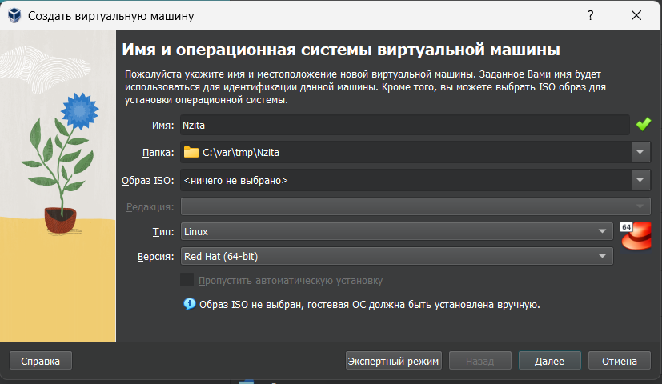{#fig:001 width=70%}

## Выполнение лабораторной работы

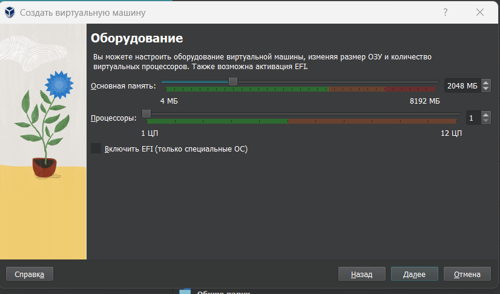{#fig:002 width=70%}

## Установка и настройка ОС

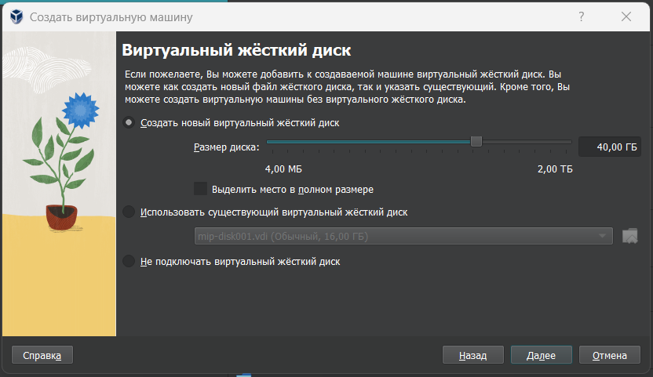{#fig:003 width=70%}

## Установка и настройка ОС

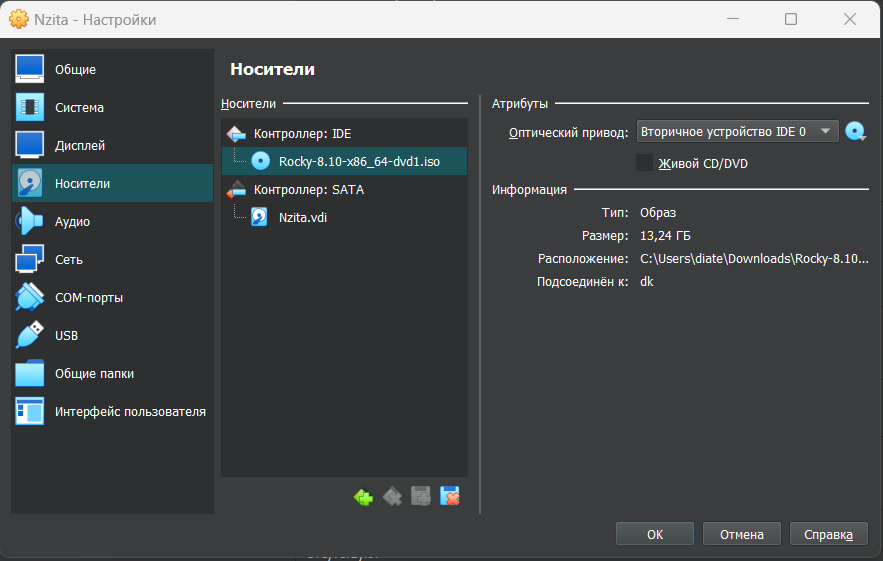{#fig:004 width=70%}

## Установка и настройка ОС

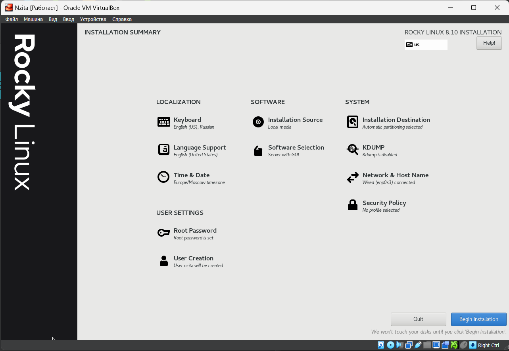{#fig:005 width=70%}

## Установка и настройка ОС

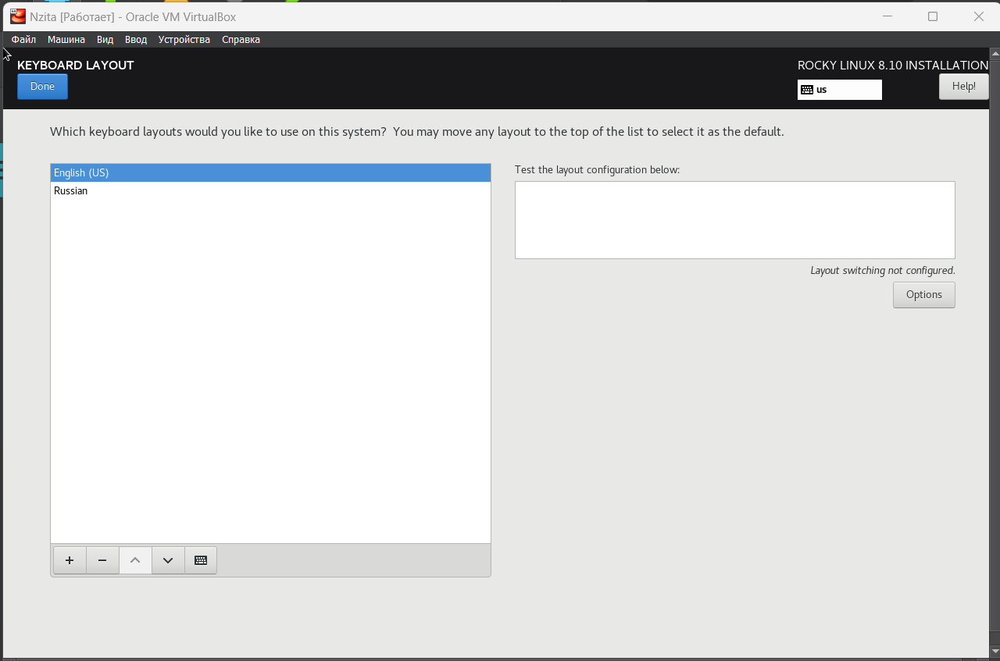{#fig:006 width=70%}

## Установка и настройка ОС

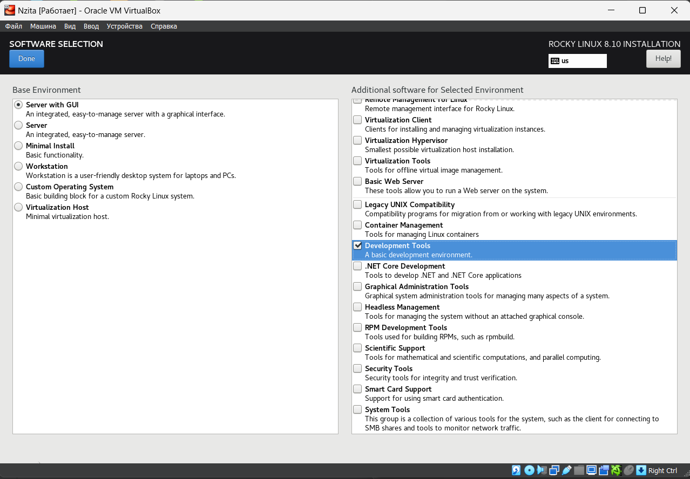{#fig:007 width=70%}

## Установка и настройка ОС

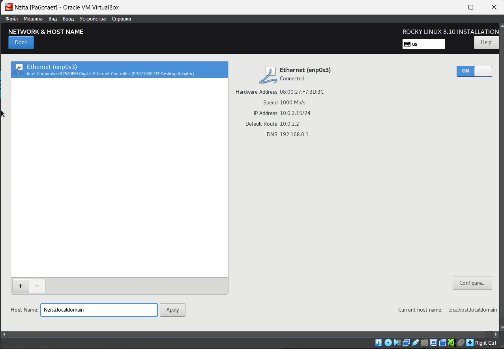{#fig:008 width=70%}

## Установка и настройка ОС

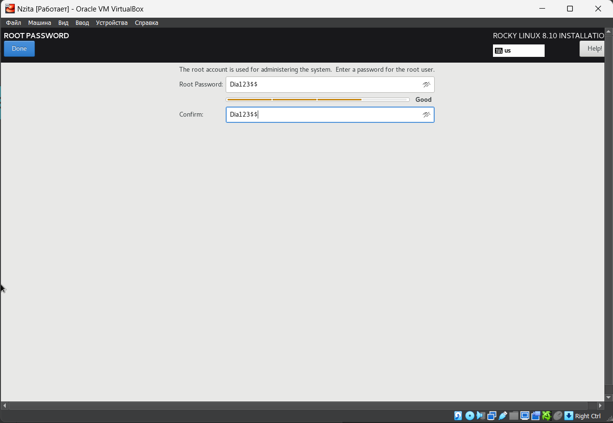{#fig:009 width=70%}

## Установка и настройка ОС

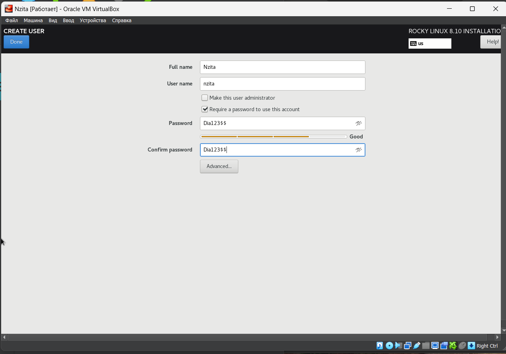{#fig:010 width=70%}

## Установка и настройка ОС

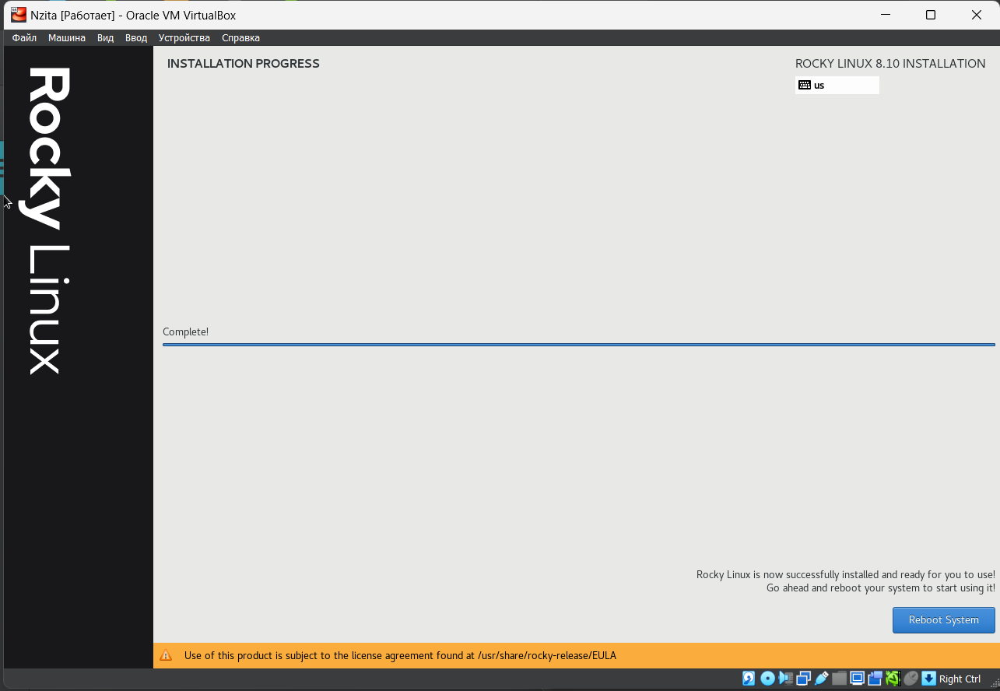{#fig:011 width=70%}

## Установка и настройка ОС

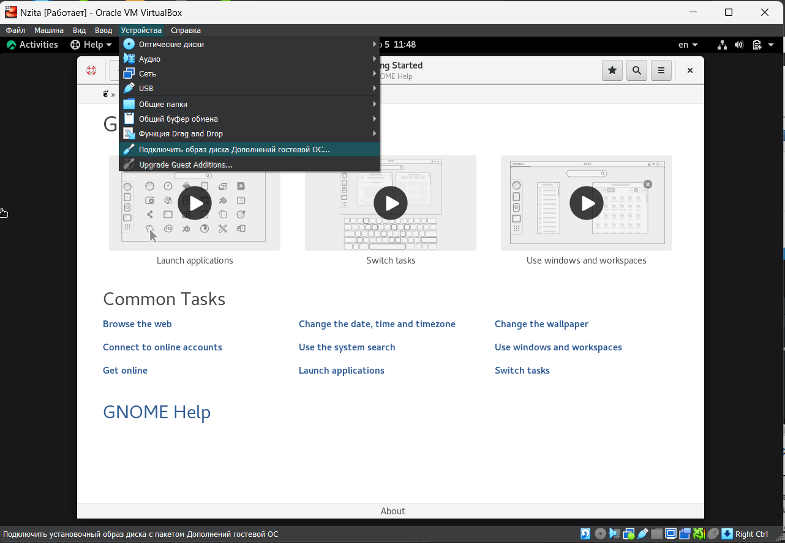{#fig:012 width=70%}

## Установка и настройка ОС

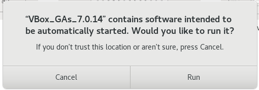{#fig:013 width=70%}

## Установка и настройка ОС

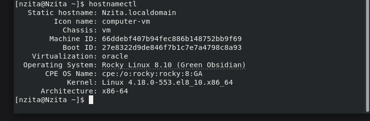{#fig:014 width=70%}

# Домашнее задание

{#fig:015 width=70%}

# Домашнее задание

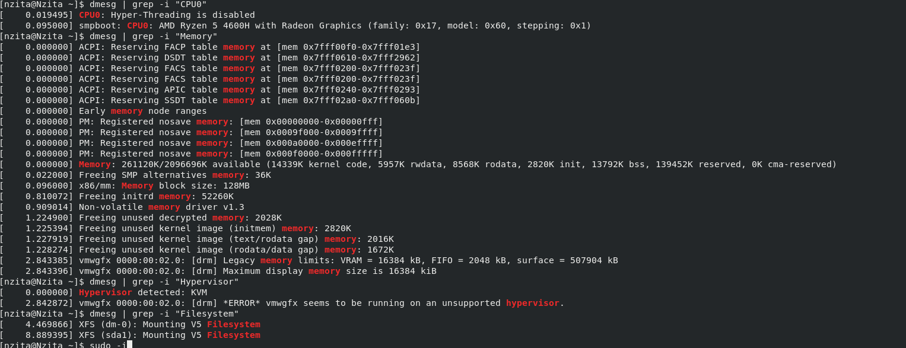{#fig:016 width=70%}

# Заключение

## Выводы

В результате выполнения работы были приобретены практические навыки установки операционной системы на виртуальную машину, настройки минимально необходимых для дальнейшей работы сервисов.

## Список литературы

1.https://www.virtualbox.org/  [Электронный ресурс]. Oracler, 2024. URL: https://www.virtualbox.org/.
2. https://rockylinux.org/pt-PT [Электронный ресурс]. Red Hat, Inc., 2024. URL: https://rockylinux.org.

