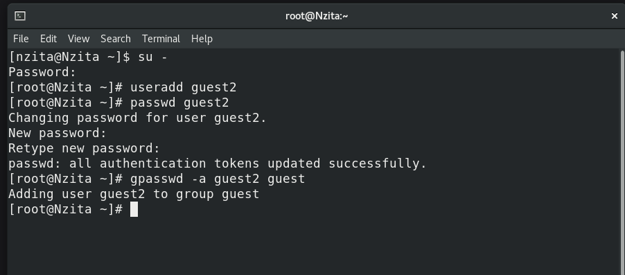
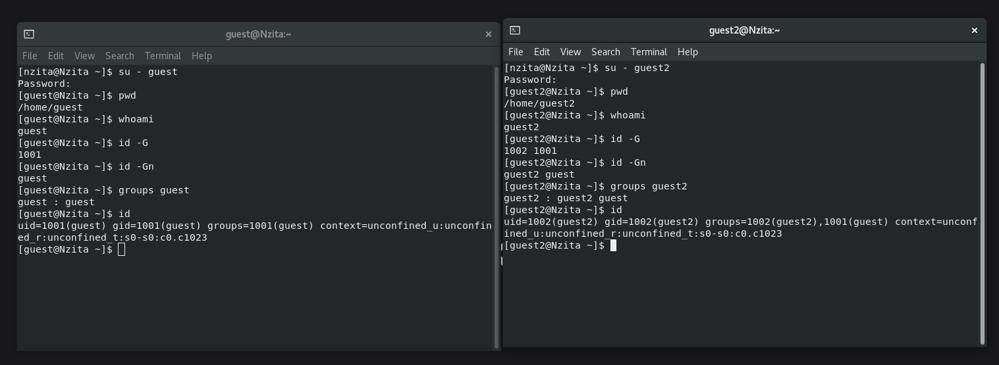
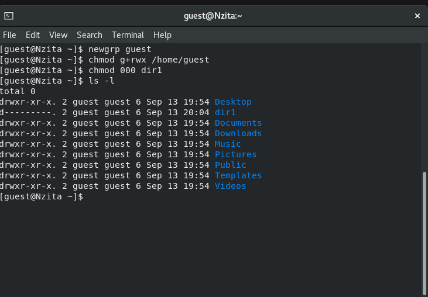
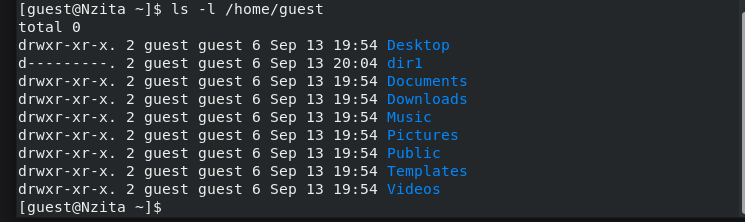

---
# Front matter
lang: ru-RU
title: "Основы информационной безопасности"
subtitle: "Лабораторная работа № 3. Дискреционное разграничение прав в Linux. Два пользователя"

author: "Нзита Диатезилуа Катенди"

# Formatting
toc-title: "Содержание"
toc: true # Table of contents
toc_depth: 2
lof: true # List of figures
fontsize: 12pt
linestretch: 1.5
papersize: a4paper
documentclass: scrreprt
polyglossia-lang: russian
polyglossia-otherlangs: english
mainfont: PT Serif
romanfont: PT Serif
sansfont: PT Sans
monofont: PT Mono
mainfontoptions: Ligatures=TeX
romanfontoptions: Ligatures=TeX
sansfontoptions: Ligatures=TeX,Scale=MatchLowercase
monofontoptions: Scale=MatchLowercase
indent: true
pdf-engine: lualatex
header-includes:
  - \linepenalty=10 # the penalty added to the badness of each line within a paragraph (no associated penalty node) Increasing the υalue makes tex try to haυe fewer lines in the paragraph.
  - \interlinepenalty=0 # υalue of the penalty (node) added after each line of a paragraph.
  - \hyphenpenalty=50 # the penalty for line breaking at an automatically inserted hyphen
  - \exhyphenpenalty=50 # the penalty for line breaking at an explicit hyphen
  - \binoppenalty=700 # the penalty for breaking a line at a binary operator
  - \relpenalty=500 # the penalty for breaking a line at a relation
  - \clubpenalty=150 # extra penalty for breaking after first line of a paragraph
  - \widowpenalty=150 # extra penalty for breaking before last line of a paragraph
  - \displaywidowpenalty=50 # extra penalty for breaking before last line before a display math
  - \brokenpenalty=100 # extra penalty for page breaking after a hyphenated line
  - \predisplaypenalty=10000 # penalty for breaking before a display
  - \postdisplaypenalty=0 # penalty for breaking after a display
  - \floatingpenalty = 20000 # penalty for splitting an insertion (can only be split footnote in standard LaTeX)
  - \raggedbottom # or \flushbottom
  - \usepackage{float} # keep figures where there are in the text
  - \floatplacement{figure}{H} # keep figures where there are in the text
---

# ПЦель работы

Получение практических навыков работы в консоли с атрибутами файлов для групп пользователей

# Теоретические сведения

При работе с комадой chmod важно понимать основные права доступа, которвые назначают файлам или каталогам. В Linux используется три основных типа прав доступа[@scott_linux_2019]:

 - Чтение (Read) — обозначается буквой «r». Предоставляет возможность просматривать содержимое файла или каталога.
  - Запись (Write) — обозначается буквой «w». Позволяет создавать, изменять и удалять файлы внутри каталога, а также изменять содержимое файла.
  - Выполнение (Execute) — обозначается буквой «x». Дает разрешение на выполнение файла или на вход в каталог.

Каждый из указанных выше типов прав доступа может быть назначен трем группам пользователей:

  - Владелец (Owner) — пользователь, который является владельцем файла или каталога.
  - Группа (Group) — группа пользователей, к которой принадлежит файл или каталог.
  - Остальные пользователи (Others) — все остальные пользователи системы.

Комбинация этих базовых прав доступа для каждой из групп пользователей определяет полный набор прав доступа для файла или каталога.

# Выполнение лабораторной работы

  В установление при выполнении предыдущей лабораторной работы ОС создадим учетную запись пользователя и добввляем его в группу guest (рис. @fig:001)

{#fig:001 width=70%}

 Осуществим вход в систему от двух пользователей на двух разных консолях: 
 guest на первой консоли и guest2 на второй консоли. Для обоих пользователей командой pwd определим директорию, в которой находимся, увидим, что она совпадает с приглашениями командной строки. Уточните имя нашего пользователя, его группу, кто входит в неё и к каким группам принадлежит он сам. Определим командами groups guest и groups guest2, в какие группы входят пользователи guest и guest2. Увидим, что guest принадлежит одной группе guet c ig 2001, а двум группам guest и guest2 с id 1001 и 1002. С помощью команд id -Gn и id -G можно увидеть только id существующии из групп и название соответственно(рис. @fig:002)

{#fig:002 width=70%}

Посмотрев информацию о группа этих пользователей в файле `/etc/group` получим аналогичную информацию(рис. @fig:003)

{#fig:003 width=70%}

От имени пользователя guest2 выполните регистрацию пользователя guest2 в группе guest командой `newgrp guest`.

От имени пользователя guest изменим права директории /home/guest, разрешив все действия для пользователей группы и снимем с директории /home/guest/dir1 все атрибуты, затем проверим правильность атрибутов(рис. @fig:004, @fig:005).

{#fig:004 width=70%}

{#fig:005 width=70%}

: Установленные права и разрешённые действия {#tbl:tbl1}

| Права директории | Права файла | Создание файла | Удаление файла | Запись в файл | Чтение файла | Смена директории | Просмотр файлов в директории | Переименование файла | Смена атрибутов файла |
|------------|-----------|---------|---------|---------|---------|---------|---------|---------|---------|
|   d(000)   |   (000)   |    -    |    -    |    -    |    -    |    -    |    -    |    -    |    -    |
|   d(010)   |   (000)   |    -    |    -    |    -    |    -    |    +    |    -    |    -    |    -    |
|   d(020)   |   (000)   |    -    |    -    |    -    |    -    |    -    |    -    |    -    |    -    |
|   d(030)   |   (000)   |    +    |    +    |    -    |    -    |    +    |    -    |    +    |    -    |
|   d(040)   |   (000)   |    -    |    -    |    -    |    -    |    -    |    +    |    -    |    -    |
|   d(050)   |   (000)   |    -    |    -    |    -    |    -    |    +    |    +    |    -    |    -    |
|   d(060)   |   (000)   |    -    |    -    |    -    |    -    |    -    |    +    |    -    |    -    |
|   d(070)   |   (000)   |    +    |    +    |    -    |    -    |    +    |    +    |    +    |    -    |
|   d(000)   |   (010)   |    -    |    -    |    -    |    -    |    -    |    -    |    -    |    -    |
|   d(010)   |   (010)   |    -    |    -    |    -    |    -    |    +    |    -    |    -    |    -    |
|   d(020)   |   (010)   |    -    |    -    |    -    |    -    |    -    |    -    |    -    |    -    |
|   d(030)   |   (010)   |    +    |    +    |    -    |    -    |    +    |    -    |    +    |    -    |
|   d(040)   |   (010)   |    -    |    -    |    -    |    -    |    -    |    +    |    -    |    -    |
|   d(050)   |   (010)   |    -    |    -    |    -    |    -    |    +    |    +    |    -    |    -    |
|   d(060)   |   (010)   |    -    |    -    |    -    |    -    |    -    |    +    |    -    |    -    |
|   d(070)   |   (010)   |    +    |    +    |    -    |    -    |    +    |    +    |    +    |    -    |
|   d(000)   |   (020)   |    -    |    -    |    -    |    -    |    -    |    -    |    -    |    -    |
|   d(010)   |   (020)   |    -    |    -    |    +    |    -    |    +    |    -    |    -    |    -    |
|   d(020)   |   (020)   |    -    |    -    |    -    |    -    |    -    |    -    |    -    |    -    |
|   d(030)   |   (020)   |    +    |    +    |    +    |    -    |    +    |    -    |    +    |    -    |
|   d(040)   |   (020)   |    -    |    -    |    -    |    -    |    -    |    +    |    -    |    -    |
|   d(050)   |   (020)   |    -    |    -    |    +    |    -    |    +    |    +    |    -    |    -    |
|   d(060)   |   (020)   |    -    |    -    |    -    |    -    |    -    |    +    |    -    |    -    |
|   d(070)   |   (020)   |    +    |    +    |    +    |    -    |    +    |    +    |    +    |    -    |
|   d(000)   |   (030)   |    -    |    -    |    -    |    -    |    -    |    -    |    -    |    -    |
|   d(010)   |   (030)   |    -    |    -    |    +    |    -    |    +    |    -    |    -    |    -    |
|   d(020)   |   (030)   |    -    |    -    |    -    |    -    |    -    |    -    |    -    |    -    |
|   d(030)   |   (030)   |    +    |    +    |    +    |    -    |    +    |    -    |    +    |    -    |
|   d(040)   |   (030)   |    -    |    -    |    -    |    -    |    -    |    +    |    -    |    -    |
|   d(050)   |   (030)   |    -    |    -    |    +    |    -    |    +    |    +    |    -    |    -    |
|   d(060)   |   (030)   |    -    |    -    |    -    |    -    |    -    |    +    |    -    |    -    |
|   d(070)   |   (030)   |    +    |    +    |    +    |    -    |    +    |    +    |    +    |    -    |
|   d(000)   |   (040)   |    -    |    -    |    -    |    -    |    -    |    -    |    -    |    -    |
|   d(010)   |   (040)   |    -    |    -    |    -    |    +    |    +    |    -    |    -    |    -    |
|   d(020)   |   (040)   |    -    |    -    |    -    |    -    |    -    |    -    |    -    |    -    |
|   d(030)   |   (040)   |    +    |    +    |    -    |    +    |    +    |    -    |    +    |    -    |
|   d(040)   |   (040)   |    -    |    -    |    -    |    -    |    -    |    +    |    -    |    -    |
|   d(050)   |   (040)   |    -    |    -    |    -    |    +    |    +    |    +    |    -    |    -    |
|   d(060)   |   (040)   |    -    |    -    |    -    |    -    |    -    |    +    |    -    |    -    |
|   d(070)   |   (040)   |    +    |    +    |    -    |    +    |    +    |    +    |    +    |    -    |
|   d(000)   |   (050)   |    -    |    -    |    -    |    -    |    -    |    -    |    -    |    -    |
|   d(010)   |   (050)   |    -    |    -    |    -    |    +    |    +    |    -    |    -    |    -    |
|   d(020)   |   (050)   |    -    |    -    |    -    |    -    |    -    |    -    |    -    |    -    |
|   d(030)   |   (050)   |    +    |    +    |    -    |    +    |    +    |    -    |    +    |    -    |
|   d(040)   |   (050)   |    -    |    -    |    -    |    -    |    -    |    +    |    -    |    -    |
|   d(050)   |   (050)   |    -    |    -    |    -    |    +    |    +    |    +    |    -    |    -    |
|   d(060)   |   (050)   |    -    |    -    |    -    |    -    |    -    |    +    |    -    |    -    |
|   d(070)   |   (050)   |    +    |    +    |    -    |    +    |    +    |    +    |    +    |    -    |
|   d(000)   |   (060)   |    -    |    -    |    -    |    -    |    -    |    -    |    -    |    -    |
|   d(010)   |   (060)   |    -    |    -    |    +    |    +    |    +    |    -    |    -    |    -    |
|   d(020)   |   (060)   |    -    |    -    |    -    |    -    |    -    |    -    |    -    |    -    |
|   d(030)   |   (060)   |    +    |    +    |    +    |    +    |    +    |    -    |    +    |    -    |
|   d(040)   |   (060)   |    -    |    -    |    -    |    -    |    -    |    +    |    -    |    -    |
|   d(050)   |   (060)   |    -    |    -    |    +    |    +    |    +    |    +    |    -    |    -    |
|   d(060)   |   (060)   |    -    |    -    |    -    |    -    |    -    |    +    |    -    |    -    |
|   d(070)   |   (060)   |    +    |    +    |    +    |    +    |    +    |    +    |    +    |    -    |
|   d(000)   |   (070)   |    -    |    -    |    -    |    -    |    -    |    -    |    -    |    -    |
|   d(010)   |   (070)   |    -    |    -    |    +    |    +    |    +    |    -    |    -    |    -    |
|   d(020)   |   (070)   |    -    |    -    |    -    |    -    |    -    |    -    |    -    |    -    |
|   d(030)   |   (070)   |    +    |    +    |    +    |    +    |    +    |    -    |    +    |    -    |
|   d(040)   |   (070)   |    -    |    -    |    -    |    -    |    -    |    +    |    -    |    -    |
|   d(050)   |   (070)   |    -    |    -    |    +    |    +    |    +    |    +    |    -    |    -    |
|   d(060)   |   (070)   |    -    |    -    |    -    |    -    |    -    |    +    |    -    |    -    |
|   d(070)   |   (070)   |    +    |    +    |    +    |    +    |    +    |    +    |    +    |    -    |

В табл. [-@tbl:tbl2] приведены данные о том, какие минимальные права должны быть для совершения различных действий.

: Минимальные права для совершения операций {#tbl:tbl2}

| Операция | Минимальные права на директорию | Минимальные права на файл |
|-----------------------|------------|-----------|
|Создание файла|            d(030)               |               (000)            |
|Удаление файла|            d(030)               |               (000)            |
|Чтение файла|            d(010)               |               (040)            |
|Запись в файл|            d(010)               |               (020)            |
|Переименование файла |            d(030)               |               (000)            |
|Создание поддиректории |            d(030)               |               (000)            |
|Удаление поддиректории |            d(030)               |               (000)            |

При сравнении с таблицей в лабораторной работе №2 можно увидеть, что отличие состоит только в том, что не владелец файла никогда не имеет прав на изменение его атрибутов. Менять права доступа (записывать в inode) может владелец файла или администратор[@uran2020]. Члены группы файла никаких особых прав на inode не имеют. Пользователь может отобрать у себя собственные права на чтение и запись в файл, но право на запись в inode (в т.ч. право на смену прав) сохраняется у владельца файла при любых обстоятельствах. Пользователь не может передать право собственности на файл другому пользователю и не может забрать право собственности на файл у другого пользователя.

# Выводы

В результате выполнения работы были прибретение практические навыки работы в консоли с атрибутами файлов для групп пользователей.

# Список литературы{.unnumbered}

::: {#refs}
:::

