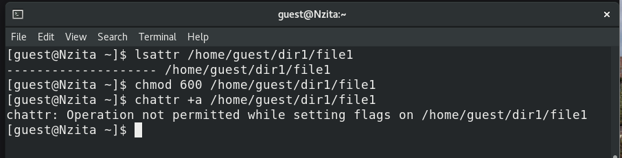
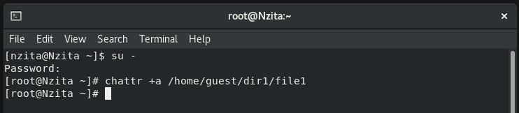
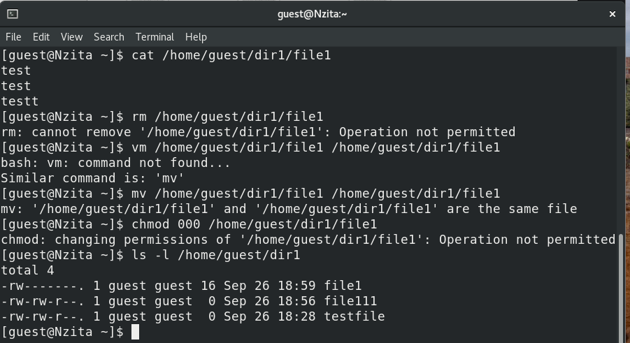

---
## Front matter
lang: ru-RU
title: Основы информационной безопасности. Лабораторная работа № 4
subtitle: Дискреционное разграничение прав в Linux. Расширенные атрибуты
author:
  - Нзита Диатезилуа Катенди
institute:
  - Российский университет дружбы народов, Москва, Россия
date: 17 сентября 2024 г.

## i18n babel
babel-lang: russian
babel-otherlangs: english

## Formatting pdf
toc: false
toc-title: Содержание
slide_level: 2
aspectratio: 169
section-titles: true
theme: metropolis
header-includes:
 - \metroset{progressbar=frametitle,sectionpage=progressbar,numbering=fraction}
---

# Информация

## Докладчик

:::::::::::::: {.columns align=center}
::: {.column width="70%"}

  * Нзита Диатезилуа Катенди
  * студент
  * Российский университет дружбы народов
  * [1032215220@pfur.ru](mailto:1032215220@pfur.ru)
  * <https://github.com/NzitaKatendi>

:::
::::::::::::::

# Вводная часть

## Цели и задачи

**Целью** данной работы является прибретенеие  практических навыков работы в консоли с расширенными атрибутами файлов.

**Задачи:**
 
 - Измениние расширенных атрибутов прав доступа
 - Проверка прав дсотупа при разных расширенных атрибутах

 **Инструмент** VirtualBox, bash

# Выполнение лабораторной работы

## Просмотр и попытка изменения расширенных атрибутов файла от имени guest

{#fig:001 width=70%}

##  Изменение расширенных атрибутов файла от имени суперпользователя

{#fig:002 width=70%}

## Проверка прав с расширенным атрибутом `a`

{#fig:003 width=70%}

##  Изменение прав доступа

{#fig:004 width=70%}

## Изменение прав доступа

{#fig:005 width=70%}

# Заключение

## Выводы

В результате выпольнения работы блили приобретены практические навыки работы в консоли с расширенными атрибутами файлов.

## Список литературы

1. Граннеман С. Скотт Граннеман: Linux. Карманный справочник. 2-е изд. Вильямс, 2019. 464 с.

