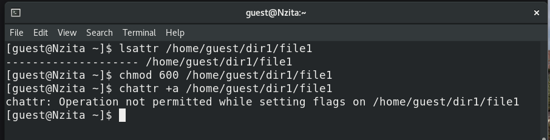
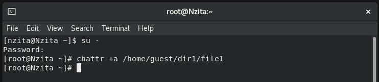
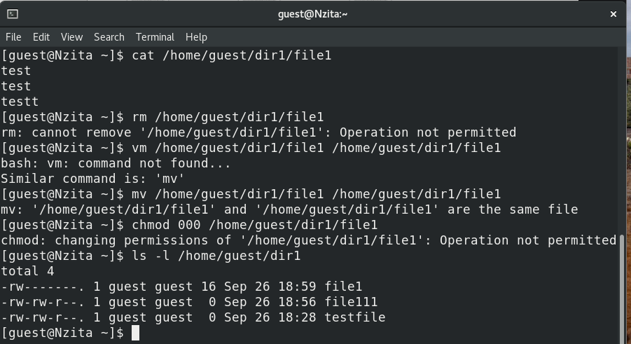

---
# Front matter
lang: ru-RU
title: "Основы информационной безопасности"
subtitle: "Лабораторная работа № 4. Дискреционное разграничение прав в Linux. Расширенные атрибуты"

author: "Нзита Диатезилуа Катенди"

# Formatting
toc-title: "Содержание"
toc: true # Table of contents
toc_depth: 2
lof: true # List of figures
fontsize: 12pt
linestretch: 1.5
papersize: a4paper
documentclass: scrreprt
polyglossia-lang: russian
polyglossia-otherlangs: english
mainfont: PT Serif
romanfont: PT Serif
sansfont: PT Sans
monofont: PT Mono
mainfontoptions: Ligatures=TeX
romanfontoptions: Ligatures=TeX
sansfontoptions: Ligatures=TeX,Scale=MatchLowercase
monofontoptions: Scale=MatchLowercase
indent: true
pdf-engine: lualatex
header-includes:
  - \linepenalty=10 # the penalty added to the badness of each line within a paragraph (no associated penalty node) Increasing the υalue makes tex try to haυe fewer lines in the paragraph.
  - \interlinepenalty=0 # υalue of the penalty (node) added after each line of a paragraph.
  - \hyphenpenalty=50 # the penalty for line breaking at an automatically inserted hyphen
  - \exhyphenpenalty=50 # the penalty for line breaking at an explicit hyphen
  - \binoppenalty=700 # the penalty for breaking a line at a binary operator
  - \relpenalty=500 # the penalty for breaking a line at a relation
  - \clubpenalty=150 # extra penalty for breaking after first line of a paragraph
  - \widowpenalty=150 # extra penalty for breaking before last line of a paragraph
  - \displaywidowpenalty=50 # extra penalty for breaking before last line before a display math
  - \brokenpenalty=100 # extra penalty for page breaking after a hyphenated line
  - \predisplaypenalty=10000 # penalty for breaking before a display
  - \postdisplaypenalty=0 # penalty for breaking after a display
  - \floatingpenalty = 20000 # penalty for splitting an insertion (can only be split footnote in standard LaTeX)
  - \raggedbottom # or \flushbottom
  - \usepackage{float} # keep figures where there are in the text
  - \floatplacement{figure}{H} # keep figures where there are in the text
---

# ПЦель работы

Получение практических навыков работы в консоли с расширенными атрибутами файлов.

# Теоретические сведения

При работе с командой chmod важно понимать основные разрешения, назначаемые файлам или каталогам. Linux использует три основных типа разрешений[@scott_linux_2019]:

 - Читать – обозначается буквой «р». Предоставляет возможность просмотра содержимого файла или каталога.
 - Пишите – обозначается буквой «ш». Он позволяет создавать, изменять и удалять файлы в каталоге, а также изменять содержимое файла.
 - Выполнить – обозначается буквой «х». Дает разрешение на выполнение файла или вход в каталог.

Каждый из вышеперечисленных типов прав доступа может быть назначен трем группам пользователей:

 - Владелец: пользователь, которому принадлежит файл или каталог.
 - Группа: группа пользователей, которой принадлежит файл или каталог.
 - Другие: все остальные пользователи системы.

Комбинация этих основных разрешений для каждой группы пользователей определяет полный набор разрешений для файла или каталога.

# Выполнение лабораторной работы

 От имени пользователя guest определиим расширенные атрибуты файла /home/guest/dir1/file1, в данный момент их нет. Установим командой chmod 600 file1 на файл file1 права, разрешающие чтение и запись для владельца файла. Попробуем установить на файл /home/guest/dir1/file1 расширенный атрибут a от имени пользователя guest. В отчет получим отказ(рис. @fig:001)

{#fig:001 width=70%}

Зайдем на третью консоль с правами администратора и попробуем установить расширенный атрибут a на файл /home/guest/dir1/file1 от имени суперпользователя(рис. @fig:002)

{#fig:002 width=70%}

установления атрибута. Затем выполним дозапись в файл file1 слова «test» командой, после этого выполним чтение файла file1 командой и убедимся, что слово test было успешно записано в file1. Попробуем удалить файл file1, стереть имеющуюся в нём информацию командой, переименовть файл и изменить его атрибуты -- ничего из этого сделать не удается(рис. @fig:003)

{#fig:003 width=70%}

Уберем из суперпользователя атрибут a и повторим все действия, которые ранее не удалось совершить(рис. @fig:004).

{#fig:004 width=70%}

Теперь мы имеем права на все эти действия

Попробуем повторить всё ещё раз, установив атрибут i(рис. @fig:005).

{#fig:005 width=70%}

Теперь над недоступна в том числе и дозапись в файл, то есть запрещены любые действия с этим файлом.

# Выводы

В результаты выпольнения работы были приобретены практические навыки работы в консоли с расширенными атрибутами файлов.

# Список литературы{.unnumbered}

::: {#refs}
:::

