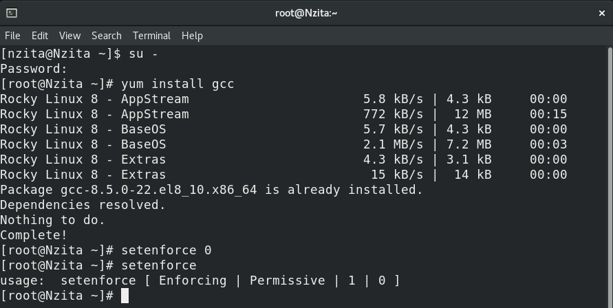
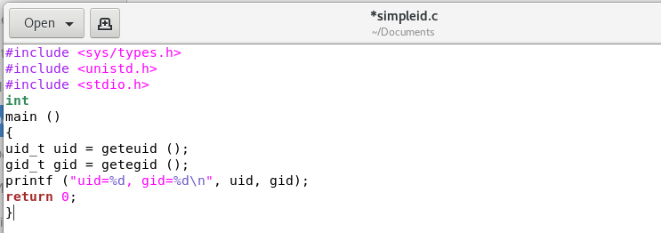
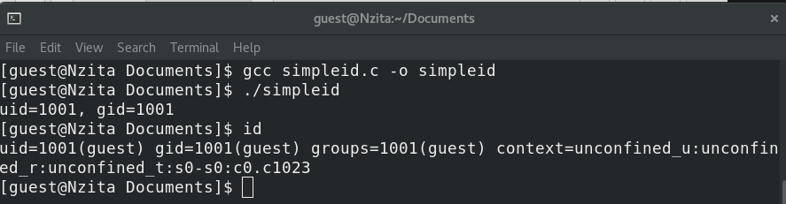
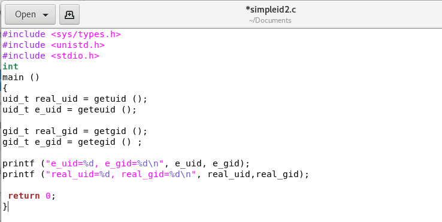
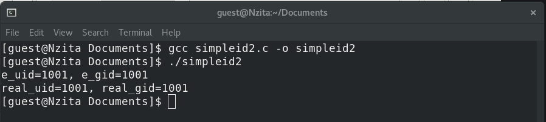
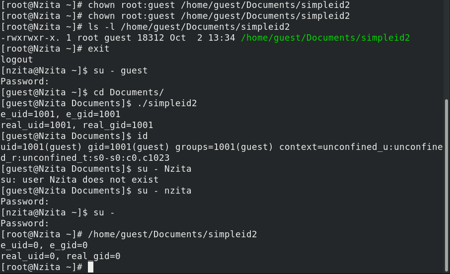
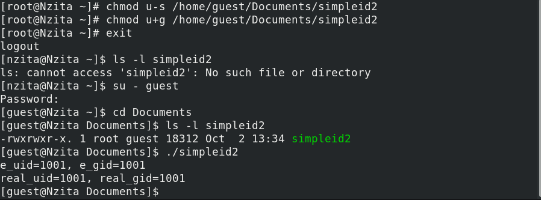
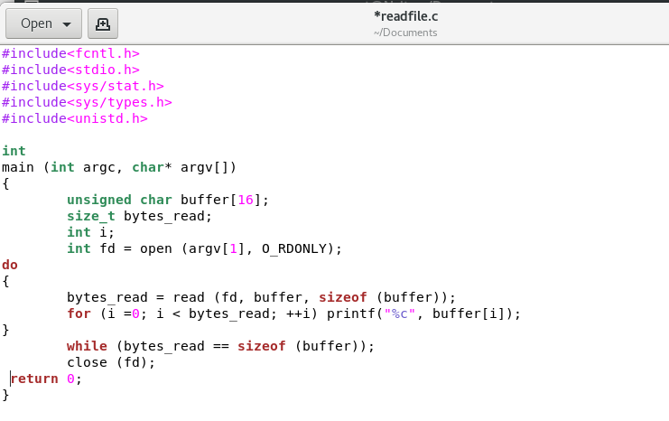
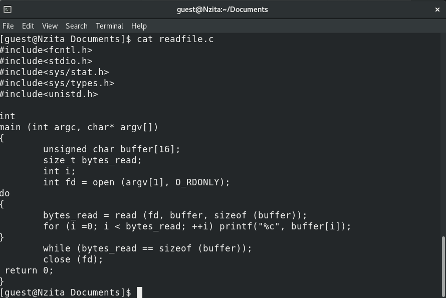
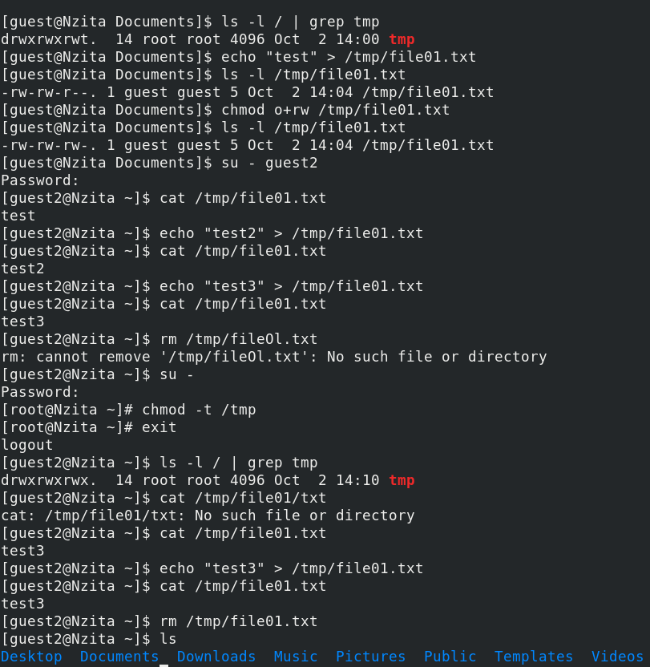

---
# Front matter
lang: ru-RU
title: "Основы информационной безопасности"
subtitle: "Лабораторная работа № 5. Дискреционное разграничение прав в Linux. Исследование влияния дополнительных атрибутов"

author: "Нзита Диатезилуа Катенди"

# Formatting
toc-title: "Содержание"
toc: true # Table of contents
toc_depth: 2
lof: true # List of figures
fontsize: 12pt
linestretch: 1.5
papersize: a4paper
documentclass: scrreprt
polyglossia-lang: russian
polyglossia-otherlangs: english
mainfont: PT Serif
romanfont: PT Serif
sansfont: PT Sans
monofont: PT Mono
mainfontoptions: Ligatures=TeX
romanfontoptions: Ligatures=TeX
sansfontoptions: Ligatures=TeX,Scale=MatchLowercase
monofontoptions: Scale=MatchLowercase
indent: true
pdf-engine: lualatex
header-includes:
  - \linepenalty=10 # the penalty added to the badness of each line within a paragraph (no associated penalty node) Increasing the υalue makes tex try to haυe fewer lines in the paragraph.
  - \interlinepenalty=0 # υalue of the penalty (node) added after each line of a paragraph.
  - \hyphenpenalty=50 # the penalty for line breaking at an automatically inserted hyphen
  - \exhyphenpenalty=50 # the penalty for line breaking at an explicit hyphen
  - \binoppenalty=700 # the penalty for breaking a line at a binary operator
  - \relpenalty=500 # the penalty for breaking a line at a relation
  - \clubpenalty=150 # extra penalty for breaking after first line of a paragraph
  - \widowpenalty=150 # extra penalty for breaking before last line of a paragraph
  - \displaywidowpenalty=50 # extra penalty for breaking before last line before a display math
  - \brokenpenalty=100 # extra penalty for page breaking after a hyphenated line
  - \predisplaypenalty=10000 # penalty for breaking before a display
  - \postdisplaypenalty=0 # penalty for breaking after a display
  - \floatingpenalty = 20000 # penalty for splitting an insertion (can only be split footnote in standard LaTeX)
  - \raggedbottom # or \flushbottom
  - \usepackage{float} # keep figures where there are in the text
  - \floatplacement{figure}{H} # keep figures where there are in the text
---

# ПЦель работы

Изучение механизмов изменения идентификаторов, применения SetUID- и Sticky-битов. Получение практических навыков работы в консоли с дополнительными атрибутами. Рассмотрение работы механизма смены идентификатора процессов пользователей, а также влияние бита Sticky на запись и удаление файлов.

# Теоретические сведения

При работе с командой chmod важно понимать основные разрешения, назначаемые файлам или каталогам. В Linux[@scott_linux_2019] существует три основных типа разрешений:

- Чтение — обозначается буквой «r». Предоставляет возможность просмотра содержимого файла или каталога.

- Запись — обозначается буквой «sh». Позволяет создавать, изменять и удалять файлы в каталоге, а также изменять содержимое файла.

- Выполнение — обозначается буквой «x». Предоставляет разрешение на выполнение файла или вход в каталог.

Каждый из вышеперечисленных типов разрешений может быть назначен трем группам пользователей:

- Владелец — пользователь, которому принадлежит файл или каталог.

- Группа — группа пользователей, к которой принадлежит файл или каталог.

- Другие — все остальные пользователи в системе.

Комбинация этих основных разрешений для каждой группы пользователей определяет полный набор разрешений для файла или каталога.

# Выполнение лабораторной работы

 Проверим установлен ли компилятора gcc, а также отклочим SELinux (рис. @fig:001)

{#fig:001 width=70%}

Войдем в систему от имен пользователя guest и создадим программу simpleid.c, которая выводит идентификатор пользователя и группы(рис. @fig:002)

{#fig:002 width=70%}

Теперь скомпириуем программу с помощью gcc, затем, запустив её, увидим, что она выводит идентификаторы пользователя и группы 1001 и 1001 для guest, что совпадает с выводом команды id(рис. @fig:003)

{#fig:003 width=70%}

Усложним программу, добавив вывод действительных идентификаторов(рис. @fig:004).

{#fig:004 width=70%}

Теперь скомпириуем программу с помощью gcc, затем, запустив её, увидим, что она выводит идентификаторы пользователя и группы 1001 и 1001 для guest, что совпадает с выводом команды id(рис. @fig:005).

{#fig:005 width=70%}

От имени суперпользователя изменим владельца файла /home/guest/simpleid2 и установим SetUID-бит. Проверим корректность установленных прав и опять запустим simpleid2(рис. @fig:006).

{#fig:006 width=70%}

Проделаем аналогичные действия относительно SetGID-бита(рис. @fig:007):

{#fig:007 width=70%}

Создадим программу для чтения файлов readfile.c(рис. @fig:008):

{#fig:008 width=70%}

Скомпилируем её и сменим владельца у файла с текстом программы, затем изменим права так, чтобы только суперпользователь (root) мог прочитать его, и проверим корректность настроек(рис. @fig:009):

{#fig:009 width=70%}

После завершения установки операционной системы корректно перезапустим виртуальную машину и при запросе примем условия лицензии. 

Проверим, что установлен атрибут Sticky на директории /tmp(в конце стоит t). Затем от имени пользователя guest создадим файл file01.txt в директории /tmp со словом test, затем просмотрим атрибуты у только что созданного файла и разрешим чтение и запись для категории пользователей «все остальные». После этого от пользователя guest2 попробуем дозаписать в этот файл новое слово, однако получим отказ, также нам отказано в перезаписи и удалении этого файла. Если же убрать Sticky бит, то нам будет разрешено удаление этого файла(рис. @fig:010):

{#fig:010 width=70%}

# Выводы

В результате выполнения работы были выполнены:

- Изечение  механизмов изменения идентификаторов, применения SetUID- и Sticky-битов.

-  Получение практических навыков работы в консоли с дополнительными атрибутами.

- Расмотрение работы механизма смены идентификатора процессов пользователей, а также влияние бита Sticky на запись и удаление файлов.
 
# Список литературы{.unnumbered}

::: {#refs}
:::

