---
# Front matter
lang: ru-RU
title: "Основы информационной безопасности"
subtitle: "Лабораторная работа № 6. Мандатное разграничение прав в Linux"

author: "Нзита Диатезилуа Катенди"

# Formatting
toc-title: "Содержание"
toc: true # Table of contents
toc_depth: 2
lof: true # List of figures
fontsize: 12pt
linestretch: 1.5
papersize: a4paper
documentclass: scrreprt
polyglossia-lang: russian
polyglossia-otherlangs: english
mainfont: PT Serif
romanfont: PT Serif
sansfont: PT Sans
monofont: PT Mono
mainfontoptions: Ligatures=TeX
romanfontoptions: Ligatures=TeX
sansfontoptions: Ligatures=TeX,Scale=MatchLowercase
monofontoptions: Scale=MatchLowercase
indent: true
pdf-engine: lualatex
header-includes:
  - \linepenalty=10 # the penalty added to the badness of each line within a paragraph (no associated penalty node) Increasing the υalue makes tex try to haυe fewer lines in the paragraph.
  - \interlinepenalty=0 # υalue of the penalty (node) added after each line of a paragraph.
  - \hyphenpenalty=50 # the penalty for line breaking at an automatically inserted hyphen
  - \exhyphenpenalty=50 # the penalty for line breaking at an explicit hyphen
  - \binoppenalty=700 # the penalty for breaking a line at a binary operator
  - \relpenalty=500 # the penalty for breaking a line at a relation
  - \clubpenalty=150 # extra penalty for breaking after first line of a paragraph
  - \widowpenalty=150 # extra penalty for breaking before last line of a paragraph
  - \displaywidowpenalty=50 # extra penalty for breaking before last line before a display math
  - \brokenpenalty=100 # extra penalty for page breaking after a hyphenated line
  - \predisplaypenalty=10000 # penalty for breaking before a display
  - \postdisplaypenalty=0 # penalty for breaking after a display
  - \floatingpenalty = 20000 # penalty for splitting an insertion (can only be split footnote in standard LaTeX)
  - \raggedbottom # or \flushbottom
  - \usepackage{float} # keep figures where there are in the text
  - \floatplacement{figure}{H} # keep figures where there are in the text
---

# ПЦель работы

Развить навыки администрирования ОС Linux. Получить первое практическое знакомство с технологией SELinux. Проверить работу SELinx на практике совместно с веб-сервером
Apache.

# Теоретические сведения

SELinux (SELinux) — это система принудительного контроля доступа, реализованная на уровне ядра[@habr_selinux]. Впервые эта система появилась в четвертой версии CentOS, а в версиях 5 и 6 реализация была существенно дополнена и улучшена. Эти улучшения позволили SELinux стать универсальной системой, способной эффективно решать многие современные проблемы. Помните, что сначала применяется классическая система прав Unix, и управление перейдет к SELinux только в случае успешной первоначальной проверки.

Домен — это список действий, которые может выполнять процесс. Обычно домен определяется как минимально возможный набор действий, с помощью которых может функционировать процесс. Таким образом, если процесс дискредитирован, злоумышленник не сможет нанести большого ущерба.

Функция — это список доменов, которые можно применить. Если заданный домен отсутствует в списке доменов роли, действия из этого домена не могут быть применены.

Тип — это набор разрешенных действий по отношению к объекту. Тип отличается от домена тем, что его можно применять к каналам, каталогам и файлам, тогда как домен применяется к процессам.

Контекст безопасности – все атрибуты SELinux – роли, типы и домены.

# Выполнение лабораторной работы

В конфигурационном файле /etc/httpd/httpd.conf зададим параметр ServerName. Также необходимо проследить, чтобы пакетный фильтр был отключён или в своей рабочей конфигурации позволял подключаться к 80-у и 81-у портам протокола tcp. Отключим фильтр командами(рис. @fig:001)

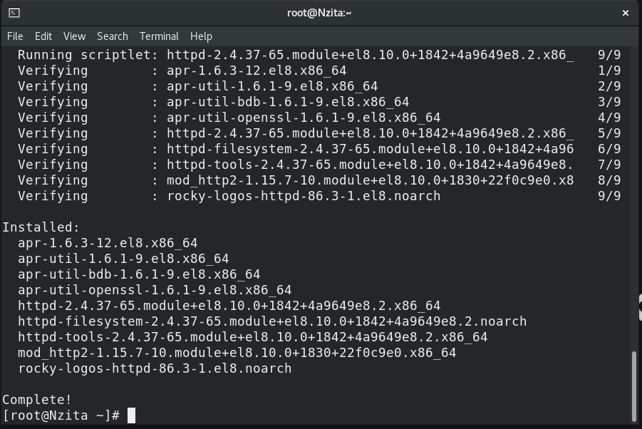{#fig:001 width=70%}

Войдем в систему с полученными учётными данными и убедимся, что SELinux работает в режиме enforcing политики targeted с помощью команд getenforce и sestatus(рис. @fig:002).

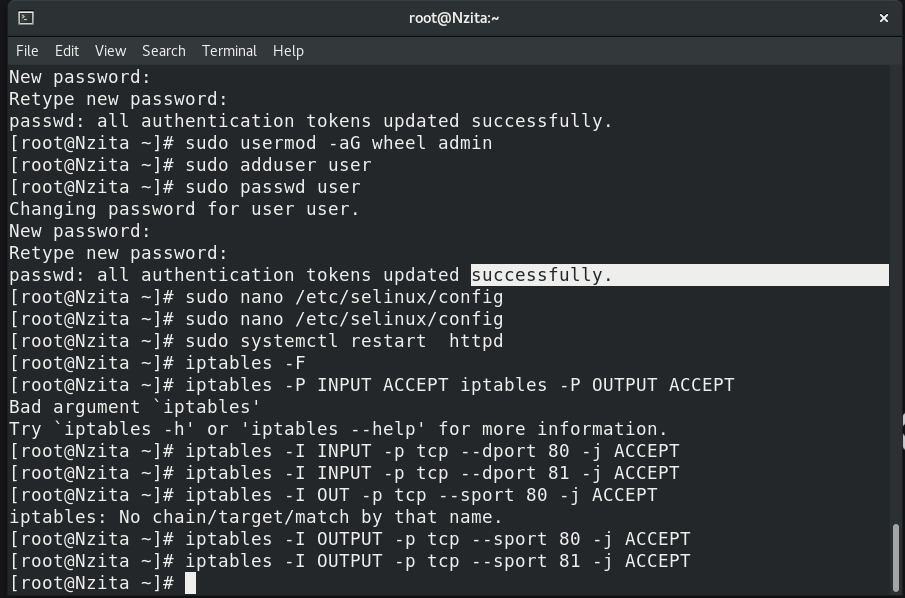{#fig:002 width=70%}

Обратимся с помощью браузера к веб-серверу, запущенному на нашем компьютере, и убедитесь, что последний работает(рис. @fig:003).

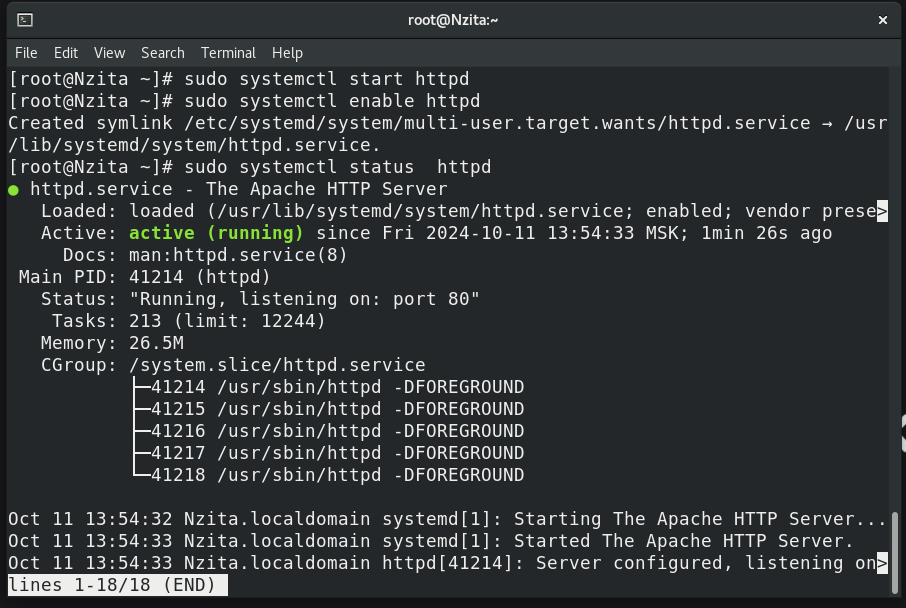{#fig:003 width=70%}

Найдите веб-сервер Apache в списке процессов, определим его контекст безопасности(рис. @fig:004)

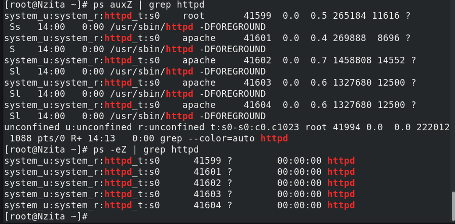{#fig:004 width=70%}

Мы можем видеть контекст безопасности SELinux: system_u:system_r:httpd_t.

Посмотрим текущее состояние переключателей SELinux для Apache(рис. @fig:005)

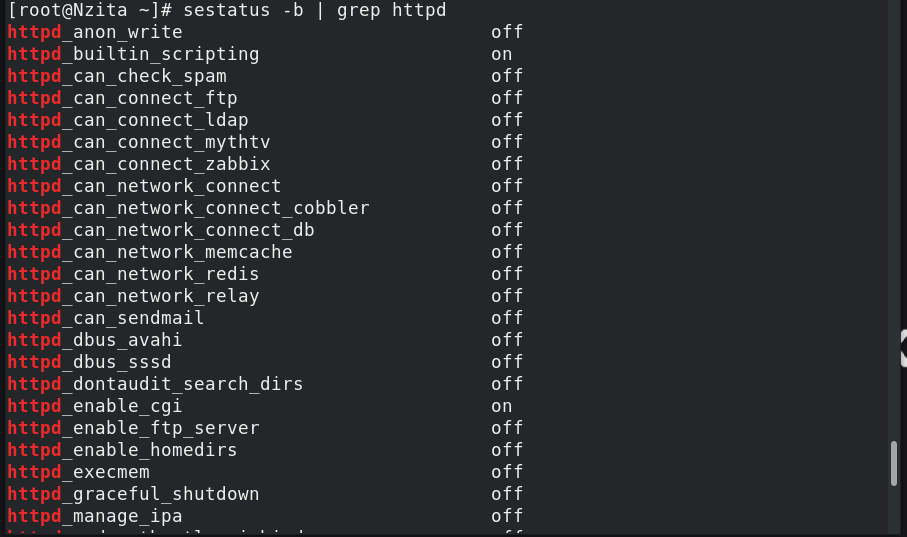{#fig:005 width=70%}

Посмотрим статистику по политике с помощью команды seinfo(рис. @fig:006):

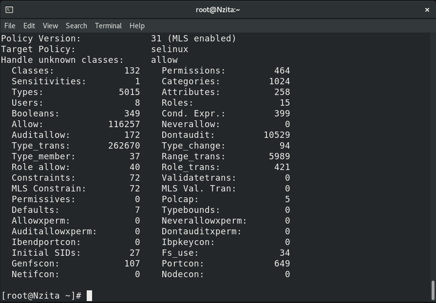{#fig:006 width=70%}

Также просмотрим множество пользователей, ролей, типов(рис. @fig:007):

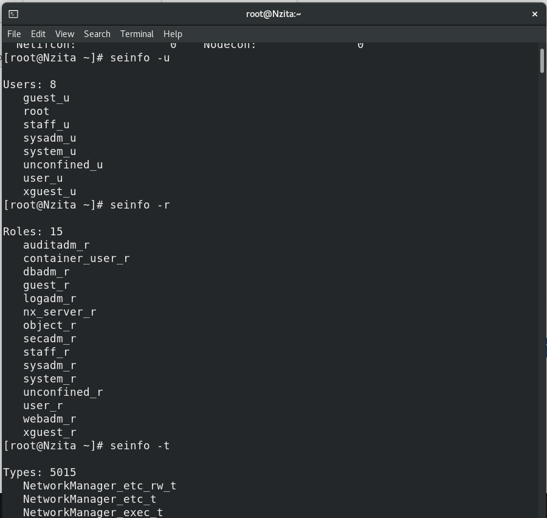{#fig:007 width=70%}

Определив тип файлов и поддиректорий, находящихся в директории /var/www, с помощью команды ls -lZ /var/www, увидим, что есть директория, содержащая cgi-скрипты, и директория /var/www/html, содержащая все скрипты httpd(в данный момент пустая)(рис. @fig:008):

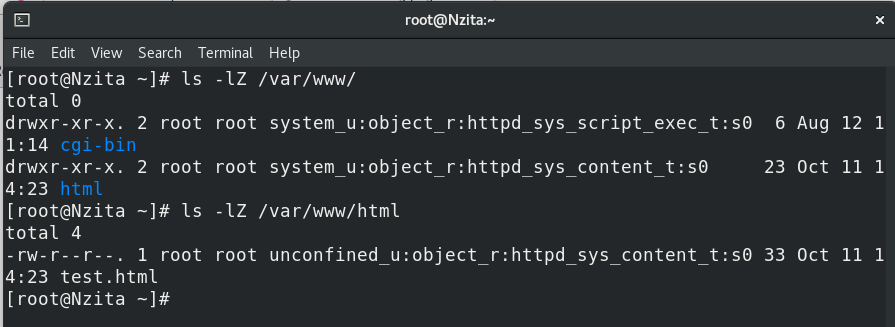{#fig:008 width=70%}

Можно увидеть, что создание файлов в директории /var/www/html разрешено только владельцу -- root.

Создадим от имени суперпользователя (так как в дистрибутиве после установки только ему разрешена запись в директорию) html-файл /var/www/html/test.html следующего содержания(рис. @fig:009):

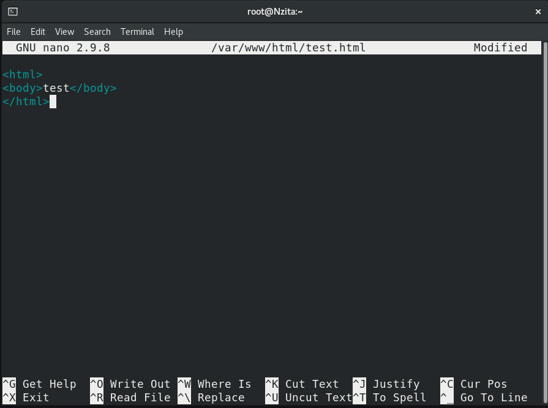{#fig:009 width=70%}

Затем посмотрим контекст безопасности, который был задан по умолчанию этому файлу(@fig:010):

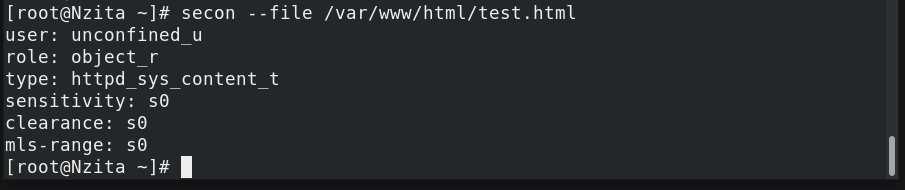{#fig:010 width=70%}

Увидим, что файлам по умолчанию сопоставляется свободный пользователь SELinux unconfined_u, указана роль  object_r используется по умолчанию для файлов на «постоянных» носителях и на сетевых файловых системах и тип httpd_sys_content_t, который позволяет процессу httpd получить доступ к файлу

Обратимся к файлу через веб-сервер, введя в браузере адрес http://127.0.0.1/test.html, убедимся, что файл был успешно отображён.(рис. @fig:011):

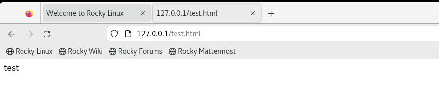{#fig:011 width=70%}

Изучив справку man httpd_selinux, выясним, какие контексты файлов определены для httpd. Сопоставив их с типом файла test.html увидим, что его контекст httpd_sys_content_t для содержимого, которое должно быть доступно для всех скриптов httpd и для самого демона. 

Изменим контекст файла /var/www/html/test.html с httpd_sys_content_t на тот, к которому процесс httpd не должен иметь доступа -- samba_share_t(рис. @fig:012):

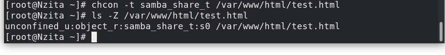{#fig:012 width=70%}

Теперь снова попробуем получить доступ к файлу через браузер и получим отказ(рис. @fig:013):

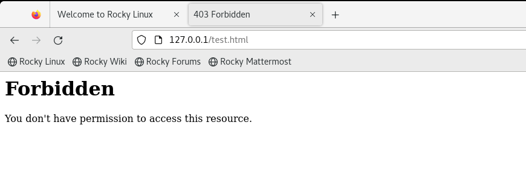{#fig:013 width=70%}

Посмотрим log-файлы веб-сервера Apache и системный лог-файл и увидим, что отказ происходит, так как доступ запрещен SELinux именно к веб-серверу(на просто просмтр текстовых файлов это не влияет)(рис. @fig:014):

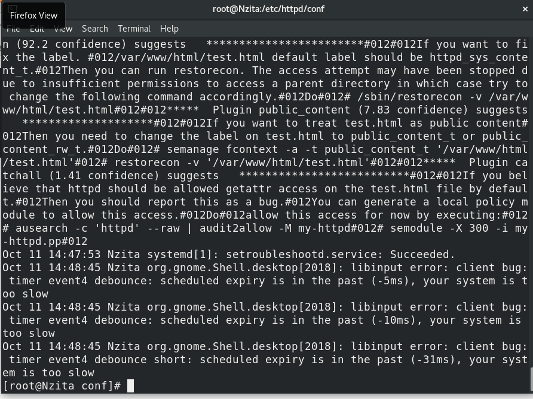{#fig:014 width=70%}

Запустим веб-сервер Apache на прослушивание ТСР-порта 81. Для этого в файле /etc/httpd/httpd.conf найдем строчку Listen 80 и заменим её на Listen 81(рис. @fig:015):

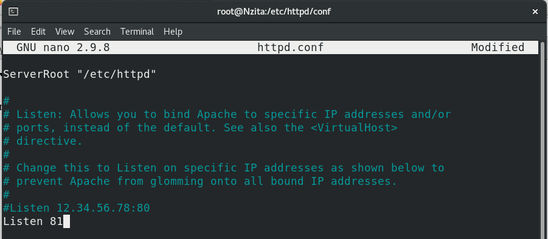{#fig:015 width=70%}

Выполниv перезапуск веб-сервера Apache и увидим предупреждение безопасности, так как 81 порт не является официальным портом для доступа по TCP(рис. @fig:016):

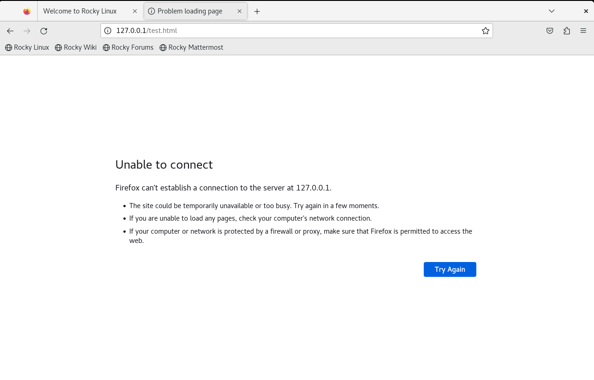{#fig:016 width=70%}

Просмотрев лог-файлы увидим, что порт для прослушивания был сменен(рис. @fig:017):

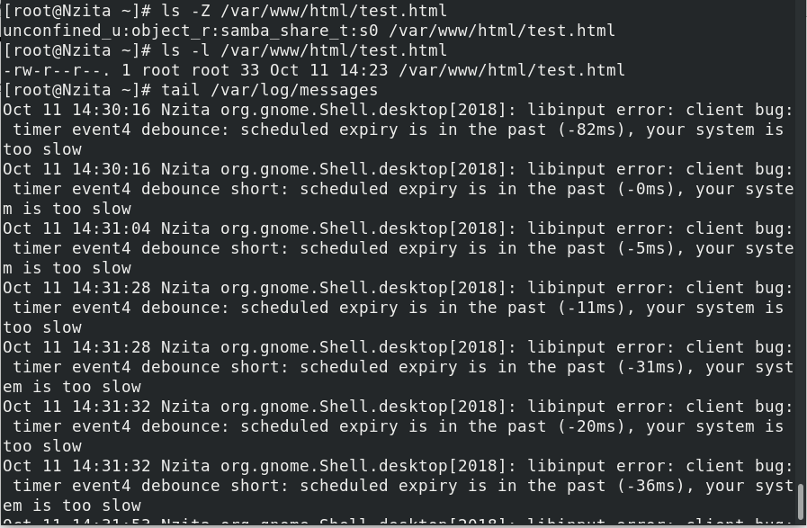{#fig:017 width=70%}

Также этот порт мог быть отклчен, тогда мы бы совсем не видели страницу, добавлять порты и просматривать актуальные можно с помощью команды seamanage(рис. @fig:018):

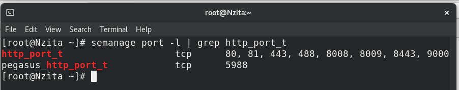{#fig:018 width=70%}

В конце работы вернем все сделанные изменения в файлах конфигурации веб-сервера.

# Выводы

В результате выполнения работы были приобретены практические навыки администрирования ОС Linux. Получено первое практическое знакомство с технологией SELinux. Проверена работа SELinx на практике совместно с веб-сервером Apache.
 
# Список литературы{.unnumbered}

::: {#refs}
:::

