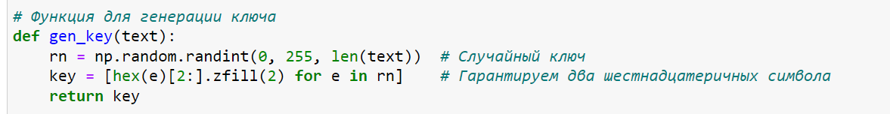
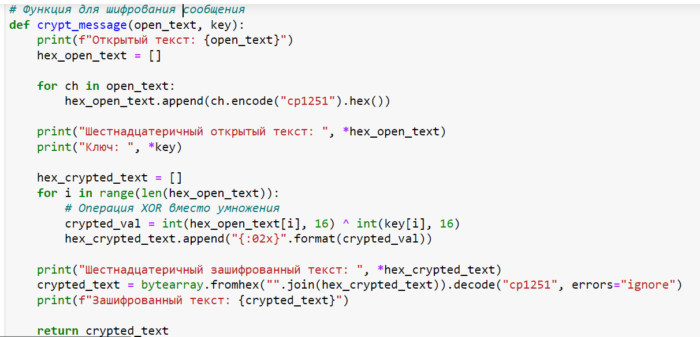
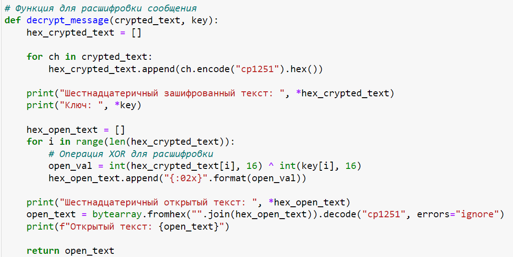
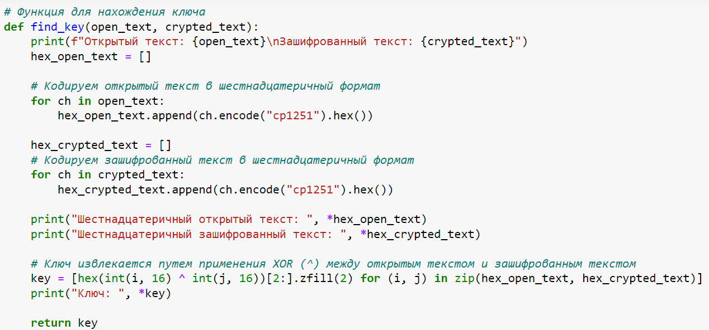
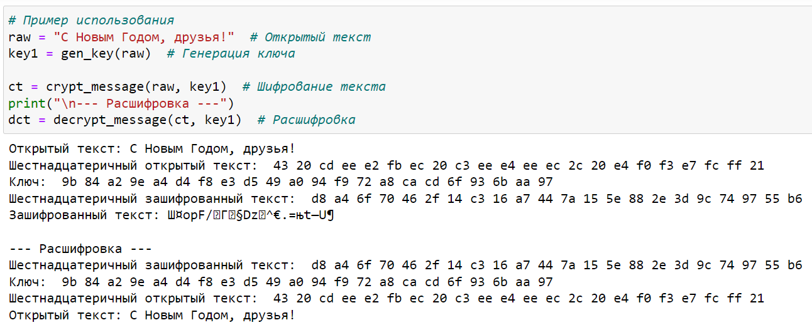
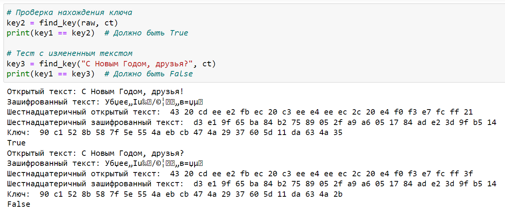

---
## Front matter
lang: ru-RU
title:  Основы информационной безопасности. Лабораторная работа №7
subtitle: Элементы криптографии. Однократное гаммирование
author: |
	Нзита Диатезилуа Катенди
institute: Российский Университет дружбы народов
date: 19.10.2024

## i18n babel
babel-lang: russian
babel-otherlangs: english

## Formatting pdf
toc: false
toc-title: Содержание
slide_level: 2
aspectratio: 169
section-titles: true
theme: metropolis
header-includes:
 - \metroset{progressbar=frametitle,sectionpage=progressbar,numbering=fraction}
 - '\makeatletter'
 - '\beamer@ignorenonframefalse'
 - '\makeatother'
---

# Информация

## Докладчик

:::::::::::::: {.columns align=center}
::: {.column width="70%"}

  * ДНзита Диатезилуа Катенди
  * студент группы НКНбд-01-21
  * Российский университет дружбы народов
  * <https://github.com/NzitaKatendi>

:::
::: {.column width="30%"}

!

:::
::::::::::::::

# Вводная часть

## Цели и задачи

**Целью** данной работы являестя освоить на практике применение режима однократного гаммирования.

**Задачи:**

Нужно подобрать ключ, чтобы получить сообщение «С Новым Годом, друзья!». Требуется разработать приложение, позволяющее шифровать и дешифровать данные в режиме однократного гаммирования. Приложение должно:

1. Определить вид шифротекста при известном ключе и известном открытом тексте.

2. Определить ключ, с помощью которого шифротекст может быть преобразован в некоторый фрагмент текста, представляющий собой один из возможных вариантов прочтения открытого текста.

**Инструмент:** Python

# Выполнение лабораторной работы

## Функции для реализации однократного гаммирования

{#fig:001 width=70%}

## Шифрование и дешифрование методом однократного гаммирования

{#fig:002 width=70%}

## Расшифровка текста

{#fig:003 width=70%}

## Нахождение ключа

{#fig:004 width=70%}

## Проверка Шифрования

{#fig:005 width=50%}

## Ожидаемый результат

{#fig:006 width=50%}

# Заключение

## Выводы

В результаты выполнения работы  были освоены практические навыки применения режима однократного гаммирования.

## Список литературы

1. Ященко В. В. Введение в криптографию. МЦНМО, 2017. 349 с.