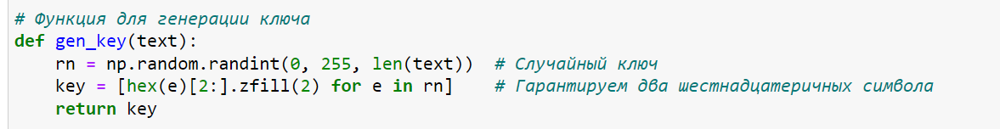
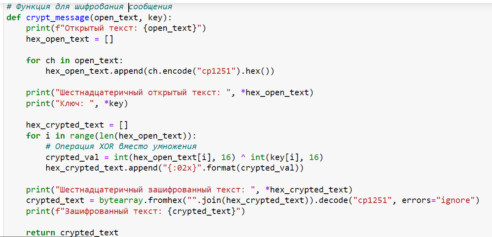
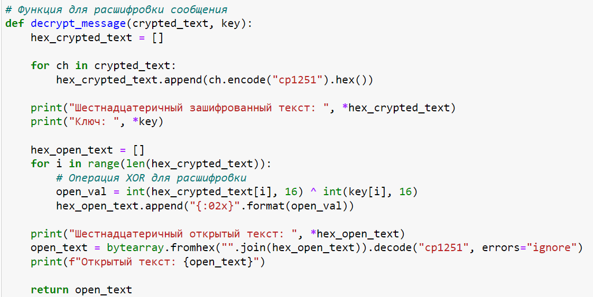
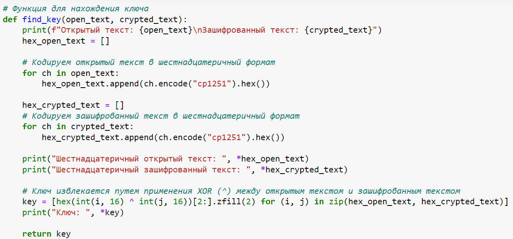
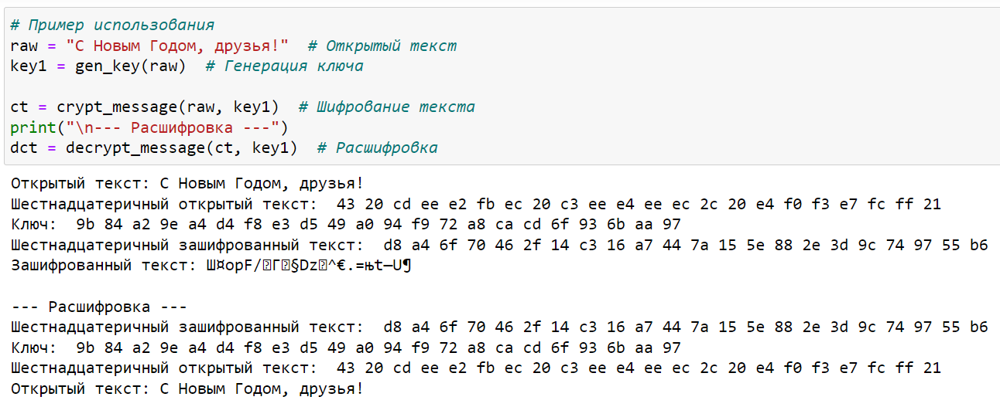
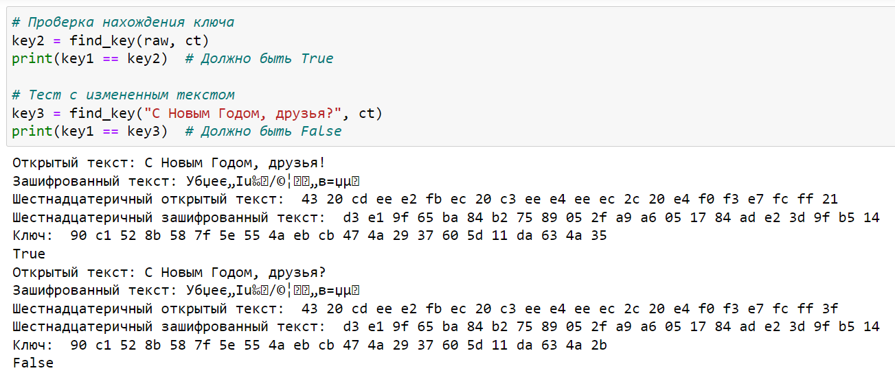

---
# Front matter
lang: ru-RU
title: "Основы информационной безопасности"
subtitle: "Лабораторная работа № 7. Элементы криптографии. Однократное гаммирование"

author: "Нзита Диатезилуа Катенди"

# Formatting
toc-title: "Содержание"
toc: true # Table of contents
toc_depth: 2
lof: true # List of figures
fontsize: 12pt
linestretch: 1.5
papersize: a4paper
documentclass: scrreprt
polyglossia-lang: russian
polyglossia-otherlangs: english
mainfont: PT Serif
romanfont: PT Serif
sansfont: PT Sans
monofont: PT Mono
mainfontoptions: Ligatures=TeX
romanfontoptions: Ligatures=TeX
sansfontoptions: Ligatures=TeX,Scale=MatchLowercase
monofontoptions: Scale=MatchLowercase
indent: true
pdf-engine: lualatex
header-includes:
  - \linepenalty=10 # the penalty added to the badness of each line within a paragraph (no associated penalty node) Increasing the υalue makes tex try to haυe fewer lines in the paragraph.
  - \interlinepenalty=0 # υalue of the penalty (node) added after each line of a paragraph.
  - \hyphenpenalty=50 # the penalty for line breaking at an automatically inserted hyphen
  - \exhyphenpenalty=50 # the penalty for line breaking at an explicit hyphen
  - \binoppenalty=700 # the penalty for breaking a line at a binary operator
  - \relpenalty=500 # the penalty for breaking a line at a relation
  - \clubpenalty=150 # extra penalty for breaking after first line of a paragraph
  - \widowpenalty=150 # extra penalty for breaking before last line of a paragraph
  - \displaywidowpenalty=50 # extra penalty for breaking before last line before a display math
  - \brokenpenalty=100 # extra penalty for page breaking after a hyphenated line
  - \predisplaypenalty=10000 # penalty for breaking before a display
  - \postdisplaypenalty=0 # penalty for breaking after a display
  - \floatingpenalty = 20000 # penalty for splitting an insertion (can only be split footnote in standard LaTeX)
  - \raggedbottom # or \flushbottom
  - \usepackage{float} # keep figures where there are in the text
  - \floatplacement{figure}{H} # keep figures where there are in the text
---

# ПЦель работы

Освоить на практике применение режима однократного гаммирования.

# Задание 

Нужно подобрать ключ, чтобы получить сообщение «С Новым Годом, друзья!». Требуется разработать приложение, позволяющее шифровать и дешифровать данные в режиме однократного гаммирования. Приложение должно:

1. Определить вид шифротекста при известном ключе и известном открытом тексте.

2. Определить ключ, с помощью которого шифротекст может быть преобразован в некоторый фрагмент текста, представляющий собой один из возможных вариантов прочтения открытого текста

# Теоретические сведения

Гаммиирование, или Шифр XOR, — метод симметричного шифрования, заключающийся в «наложении» последовательности, состоящей из случайных чисел, на открытый текст[@intro_crypto_2017]:. Последовательность случайных чисел называется гамма-последовательностью и используется для зашифровывания и расшифровывания данных. 

# Выполнение лабораторной работы

Генерация ключа (gen_key): Функция создает случайный ключ для каждого символа текста. Каждый элемент ключа представлен в шестнадцатеричной системе. (рис. @fig:001)

{#fig:001 width=70%}

Шифрование текста (crypt_message): Для каждого символа текста применяется кодировка в шестнадцатеричное значение, а затем используется операция XOR с ключом для получения зашифрованного текста.(рис. @fig:002)

{#fig:002 width=70%}

Расшифровка текста (decrypt_message): Процесс аналогичен шифрованию, но операция XOR применяется к зашифрованному тексту с ключом для восстановления исходного текста. (рис. @fig:003)

{#fig:003 width=70%}

Нахождение ключа (find_key): Операция XOR между шестнадцатеричными значениями открытого текста и зашифрованного текста позволяет найти ключ.(рис. @fig:004)

{#fig:004 width=70%}

Проверка Шифрования(рис. @fig:005) 

{#fig:005 width=70%}

Если используется исходный открытый текст, то ключи key1 и key2 должны совпадать, и результат будет True.

Если изменен открытый текст (например, добавлен вопросительный знак), ключи key1 и key3 будут различаться, и результат будет False.(рис. @fig:006) 

{#fig:006 width=70%}

# Контрольные вопросы

1. Поясните смысл однократного гаммирования.

Гаммиирование, или Шифр XOR, — метод симметричного шифрования, заключающийся в «наложении» последовательности, состоящей из случайных чисел, на открытый текст.
Если в методе шифрования используется однократная вероятностная гамма (однократное гаммирование) той же длины, что и подлежащий сокрытию текст, то текст нельзя раскрыть.

2. Перечислите недостатки однократного гаммирования.

- Если один и тот же ключ используется для шифрования нескольких сообщений, это может привести к уязвимостям. Например, если злоумышленник узнает открытый текст и соответствующий шифротекст, он может использовать эту информацию для взлома ключа.
- Однократное гаммирование не обеспечивает аутентификацию или целостность данных. Это означает, что злоумышленник может изменить шифротекст без заметных изменений в открытом тексте.

3. Перечислите преимущества однократного гаммирования.

- Однократное гаммирование обеспечивает высокий уровень конфиденциальности, поскольку шифротекст не может быть легко взломан без знания ключа.
- Однократное гаммирование обеспечивает равномерное распределение вероятностей для каждого символа в шифротексте, что делает его статистически неразличимым от случайной последовательности.
- Однократное гаммирование является простым и быстрым методом шифрования.

4. Почему длина открытого текста должна совпадать с длиной ключа?

Если в методе шифрования используется однократная вероятностная гамма (однократное гаммирование) той же длины, что и подлежащий сокрытию текст, то текст нельзя раскрыть.
   
5. Какая операция используется в режиме однократного гаммирования, назовите её особенности?

В режиме однократного гаммирования используется операция XOR (исключающее ИЛИ). Операция XOR комбинирует биты открытого текста и ключа, чтобы получить шифротекст. Особенностью операции XOR является то, что она возвращает 1 только в том случае, если один из входных битов равен 1, но не оба.

6. Как по открытому тексту и ключу получить шифротекст?

Нужно побитово сложить по модулю численное представление символов в ключе и в открытом тексте.

7. Как по открытому тексту и шифротексту получить ключ?

Нужно побитово сложить по модулю численное представление символов в шифротексте и в открытом тексте.

8. В чем заключаются необходимые и достаточные условия абсолютной стойкости шифра?

Необходимые и достаточные условия абсолютной стойкости шифра:

- полная случайность ключа;
- равенство длин ключа и открытого текста;
- однократное использование ключа.

# Выводы
 
В результаты выполнения работы  были освоены практические навыки применения режима однократного гаммирования.

# Список литературы{.unnumbered}

::: {#refs}
:::

