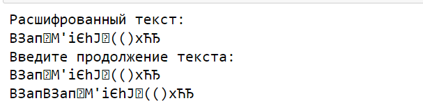

---
## Front matter
lang: ru-RU
title: Основы информационной безопасности. Лабораторная работа № 8
subtitle:  Элементы криптографии. Шифрование (кодирование) различных исходных текстов одним ключом

author:
  - Нзита Диатезилуа Катенди
institute:
  - Российский университет дружбы народов, Москва, Россия
date: 19 октября 2024 г.

## i18n babel
babel-lang: russian
babel-otherlangs: english

## Formatting pdf
toc: false
toc-title: Содержание
slide_level: 2
aspectratio: 169
section-titles: true
theme: metropolis
header-includes:
 - \metroset{progressbar=frametitle,sectionpage=progressbar,numbering=fraction}
---

# Информация

## Докладчик

:::::::::::::: {.columns align=center}
::: {.column width="70%"}

  * Нзита Диатезилуа Катенди
  * студент
  * Российский университет дружбы народов
  * [1032215220@pfur.ru](mailto:1032215220@pfur.ru)
  * <https://github.com/NzitaKatendi>

:::
::::::::::::::

# Вводная часть

## Цели и задачи

**Целью** данной работы является я освоить на практике применение режима однократного гаммирования на примере кодирования различных исходных текстов одним ключом.

**Задачи:**

- Два текста кодируются одним ключом (однократное гаммирование). Требуется не зная ключа и не стремясь его определить, прочитать оба текста. Необходимо разработать приложение, позволяющее шифровать и дешифровать тексты P1 и P2 в режиме однократного гаммирования. Приложение должно определить вид шифротекстов C1 и C2 обоих текстов P1 и P2 при известном ключе ; Необходимо определить и выразить аналитически способ, при котором злоумышленник может прочитать оба текста, не зная ключа и не стремясь его определить

**Инструмент:** Python

# Выполнение лабораторной работы

## Функции для реализации однократного гаммирования

```py
# Функция для генерации случайного ключа
def key_gen(text):
    alph = [chr(i) for i in range(1040, 1104)] + [chr(i) for i in range(33, 64)]  # Кириллица и символы
    key = "".join([random.choice(alph) for i in range(len(text))])
    return key
```
## Шифрование и дешифрование методом однократного гаммирования

```py
# Функция шифрования (XOR) текста с ключом
def encryption(text, key):
    return "".join([chr(ord(key[i]) ^ ord(text[i])) for i in range(len(key))])

# Сообщения для шифрования
P1 = "ВЗападныйФилиалБанка"
P2 = "ВСеверныйФилиалБанка"

# Генерация ключа и шифрование сообщений
key = key_gen(P1)
C1 = encryption(P1, key)
C2 = encryption(P2, key)
```
## Способ расшифровки текстов без знания ключа

$$
C1 \oplus C2 \oplus P1 = P1 \oplus P2 \oplus P1 = P2
$$

## Способ расшифровки текстов без знания ключа

```py
# Известный фрагмент второго сообщения
fragment = "ВСев"

msg2 = fragment
c1, c2 = C1, C2  # Зашифрованные сообщения
length = len(msg2)

# Цикл расшифровки части первого сообщения
while length <= len(P1):
    # XOR зашифрованных сообщений до текущей длины
    C12 = encryption(C1[:length], C2[:length])
    
    # Расшифровка первого сообщения через XOR с известной частью второго сообщения
    msg1 = encryption(C12, msg2)
    
    # Вывод расшифрованного текста
    print("Расшифрованный текст:")
    print(msg1 + c1[length:])
    
    # Ввод следующей части текста
    print("Введите продолжение текста: ")
    msg1 += input()
    
    # Обновление длины расшифрованного текста
    length = len(msg1)
    
    # Вывод обновленного текста
    print(msg1 + c1[length:])
    
    # Обмен сообщениями для следующей итерации
    msg1, msg2 = msg2, msg1
    c1, c2 = c2, c1
```
{#fig:001 width=70%}

# Заключение

## Выводы

 В результаты выполнения работы были и освоены практические навыки применения режима однократного гаммирования на примере кодирования различных исходных текстов одним ключом

## Список литературы

1. Ященко В. В. Введение в криптографию. МЦНМО, 2017. 349 с.