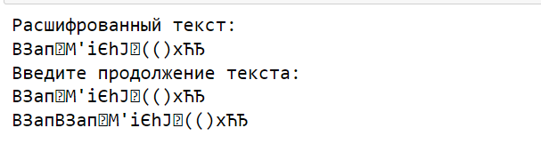

---
# Front matter
lang: ru-RU
title: "Основы информационной безопасности"
subtitle: "Лабораторная работа № 8. Элементы криптографии. Шифрование (кодирование) различных исходных текстов одним ключом"

author: "Нзита Диатезилуа Катенди"

# Formatting
toc-title: "Содержание"
toc: true # Table of contents
toc_depth: 2
lof: true # List of figures
fontsize: 12pt
linestretch: 1.5
papersize: a4paper
documentclass: scrreprt
polyglossia-lang: russian
polyglossia-otherlangs: english
mainfont: PT Serif
romanfont: PT Serif
sansfont: PT Sans
monofont: PT Mono
mainfontoptions: Ligatures=TeX
romanfontoptions: Ligatures=TeX
sansfontoptions: Ligatures=TeX,Scale=MatchLowercase
monofontoptions: Scale=MatchLowercase
indent: true
pdf-engine: lualatex
header-includes:
  - \linepenalty=10 # the penalty added to the badness of each line within a paragraph (no associated penalty node) Increasing the υalue makes tex try to haυe fewer lines in the paragraph.
  - \interlinepenalty=0 # υalue of the penalty (node) added after each line of a paragraph.
  - \hyphenpenalty=50 # the penalty for line breaking at an automatically inserted hyphen
  - \exhyphenpenalty=50 # the penalty for line breaking at an explicit hyphen
  - \binoppenalty=700 # the penalty for breaking a line at a binary operator
  - \relpenalty=500 # the penalty for breaking a line at a relation
  - \clubpenalty=150 # extra penalty for breaking after first line of a paragraph
  - \widowpenalty=150 # extra penalty for breaking before last line of a paragraph
  - \displaywidowpenalty=50 # extra penalty for breaking before last line before a display math
  - \brokenpenalty=100 # extra penalty for page breaking after a hyphenated line
  - \predisplaypenalty=10000 # penalty for breaking before a display
  - \postdisplaypenalty=0 # penalty for breaking after a display
  - \floatingpenalty = 20000 # penalty for splitting an insertion (can only be split footnote in standard LaTeX)
  - \raggedbottom # or \flushbottom
  - \usepackage{float} # keep figures where there are in the text
  - \floatplacement{figure}{H} # keep figures where there are in the text
---

# Цель работы

Освоить на практике применение режима однократного гаммирования на примере кодирования различных исходных текстов одним ключом.

# Задание 

Два текста кодируются одним ключом (однократное гаммирование). Требуется не зная ключа и не стремясь его определить, прочитать оба текста. Необходимо разработать приложение, позволяющее шифровать и дешифровать тексты P1 и P2 в режиме однократного гаммирования. Приложение должно определить вид шифротекстов C1 и C2 обоих текстов P1 и P2 при известном ключе ; Необходимо определить и выразить аналитически способ, при котором злоумышленник может прочитать оба текста, не зная ключа и не стремясь его определить

# Теоретические сведения

В результате выполнения работы были освоены практические навыки применения режима однократного гаммирования на примере кодирования различных исходных текстов одним ключом

# Выполнение лабораторной работы

Создадим функции: `key_gen` -- отвечает за генерацию случайного ключа(составляется выбором из букв кириллицы больших и малых, символов, цифр), `encryption` -- принимает на вход текст и ключ, а затем осуществляет посимвольное сложение по модулю 2:

```py
import random

# Функция для генерации случайного ключа
def key_gen(text):
    alph = [chr(i) for i in range(1040, 1104)] + [chr(i) for i in range(33, 64)]  # Кириллица и символы
    key = "".join([random.choice(alph) for i in range(len(text))])
    return key
```
Сначала зашифруем два сообщения:

```py
# Функция шифрования (XOR) текста с ключом
def encryption(text, key):
    return "".join([chr(ord(key[i]) ^ ord(text[i])) for i in range(len(key))])

# Сообщения для шифрования
P1 = "ВЗападныйФилиалБанка"
P2 = "ВСеверныйФилиалБанка"

# Генерация ключа и шифрование сообщений
key = key_gen(P1)
C1 = encryption(P1, key)
C2 = encryption(P2, key)
```

Опишем случай, когда злоумышленник может прочитать оба текста, не зная ключа и не стремясь его определить. Предположим, что одна из телеграмм является шаблоном -- т.е. имеет текст фиксированный формат, в который вписываются значения полей. Допустим, что злоумышленнику этот формат известен. Тогда он получает достаточно много пар $C1 \oplus C2$ (известен вид обеих шифровок). Тогда зная P1 имеем:

$$
C1 \oplus C2 \oplus P1 = P1 \oplus P2 \oplus P1 = P2. 
$$

Давайте применим этот процесс на практике.
Давайте применим наши функции к данной базе данных. Предположим, мы знаем часть второй истории. В цикле while он интерактивно принимает подмножество сообщений, прежде чем мы примем во внимание их все:

```py
# Известный фрагмент второго сообщения
fragment = "ВСев"

msg2 = fragment
c1, c2 = C1, C2  # Зашифрованные сообщения
length = len(msg2)

# Цикл расшифровки части первого сообщения
while length <= len(P1):
    # XOR зашифрованных сообщений до текущей длины
    C12 = encryption(C1[:length], C2[:length])
    
    # Расшифровка первого сообщения через XOR с известной частью второго сообщения
    msg1 = encryption(C12, msg2)
    
    # Вывод расшифрованного текста
    print("Расшифрованный текст:")
    print(msg1 + c1[length:])
    
    # Ввод следующей части текста
    print("Введите продолжение текста: ")
    msg1 += input()
    
    # Обновление длины расшифрованного текста
    length = len(msg1)
    
    # Вывод обновленного текста
    print(msg1 + c1[length:])
    
    # Обмен сообщениями для следующей итерации
    msg1, msg2 = msg2, msg1
    c1, c2 = c2, c1

```
{#fig:001 width=70%}

# Контрольные вопросы

1. Как, зная один из текстов (P1 или P2), определить другой, не зная при этом ключа?

Предположим, что одна из телеграмм является шаблоном -- т.е. имеет текст фиксированный формат, в который вписываются значения полей. Допустим, что злоумышленнику этот формат известен. Тогда он получает достаточно много пар $C1 \oplus C2$ (известен вид обеих шифровок). Тогда зная P1 имеем:

$$
C1 \oplus C2 \oplus P1 = P1 \oplus P2 \oplus P1 = P2. 
$$

2. Что будет при повторном использовании ключа при шифровании текста?

Текст вернется к исходному виду.

3. Как реализуется режим шифрования однократного гаммирования одним ключом двух открытых текстов?

К обоим текстам применяется один и тот же ключ.

4. Перечислите недостатки шифрования одним ключом двух открытых
текстов.

Главным недостатком является повышение уязвимости. Если злоумышленник узнает один из исзодных текстов или даже его часть, то он может узнать и второй текст.

5. Перечислите преимущества шифрования одним ключом двух открытых
текстов.

Ключи могут занимать большое количество памяти и долго генерироваться, поэтому использование одного ключа оптимизирует шифрование. Также это упрощает дешифровку.

# Выводы

В результате выполнения работы были освоены практические навыки применения режима однократного гаммирования на примере кодирования различных исходных текстов одним ключом

# Список литературы{.unnumbered}

::: {#refs}
:::


