---
## Front matter
lang: ru-RU
title: "Основы информационной безопасности. Индивидуальный проект"
subtitle: Этап №1. Установка Kali Linux
author:
  - Нзита Диатезилуа Катенди
institute:
  - Российский университет дружбы народов, Москва, Россия
date: 7 сентября 2024 г.

## i18n babel
babel-lang: russian
babel-otherlangs: english

## Formatting pdf
toc: false
toc-title: Содержание
slide_level: 2
aspectratio: 169
section-titles: true
theme: metropolis
header-includes:
 - \metroset{progressbar=frametitle,sectionpage=progressbar,numbering=fraction}
---

# Информация

## Докладчик

:::::::::::::: {.columns align=center}
::: {.column width="70%"}

  * Нзита Диатезилуа Катенди
  * студент
  * Российский университет дружбы народов
  * [1032215220@pfur.ru](mailto:1032215220@pfur.ru)
  * <https://github.com/NzitaKatendi>

:::
::::::::::::::

# Вводная часть

## Цели и задачи

**Целью** данной работы является установка дистрибутива Kali Linux в виртуальную машину.

**Задачи:**

- Установить Kali Linux на  VirtualBox.
- Провести первоначальную настройку ОС

**Инструмент:** VirtualBox

# Выполнение лабораторной работы

## Установка и настройка ОС

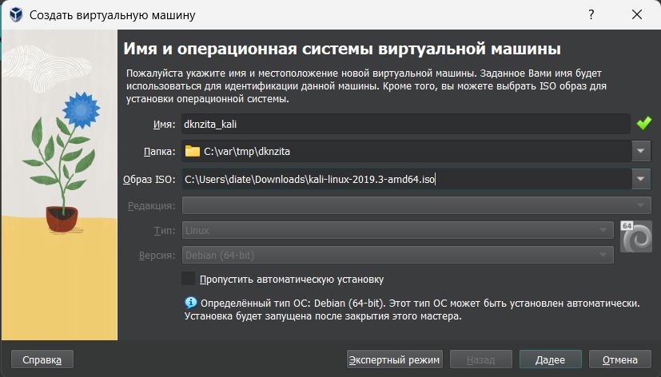{#fig:001 width=70%}

## Установка и настройка ОС

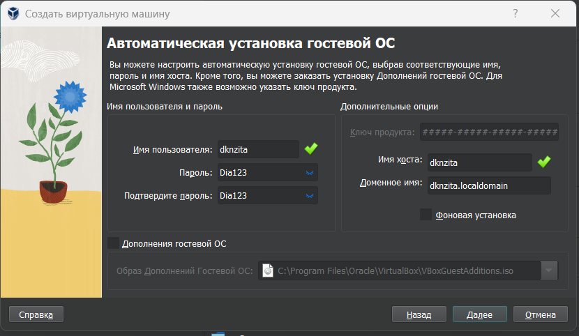{#fig:002 width=70%}

## Установка и настройка ОС

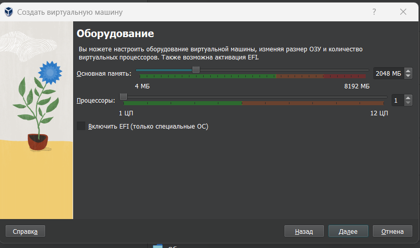{#fig:003 width=70%}

## Установка и настройка ОС

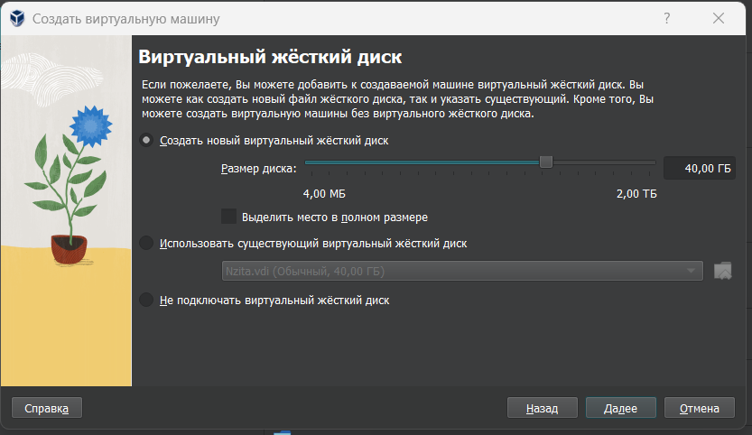{#fig:004 width=70%}

## Установка и настройка ОС

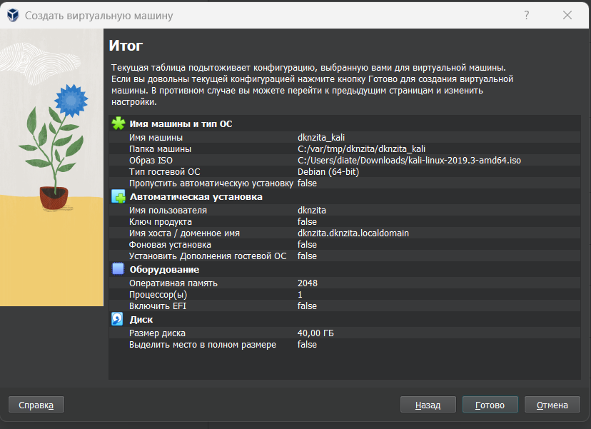{#fig:005 width=70%}

## Установка и настройка ОС

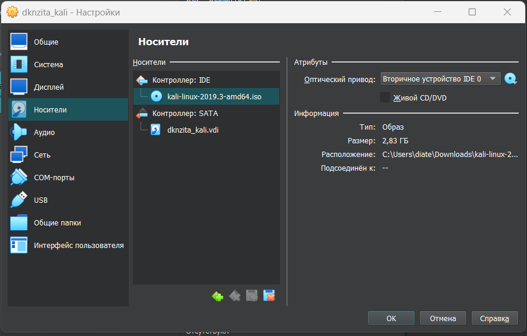{#fig:006 width=70%}

## Установка и настройка ОС

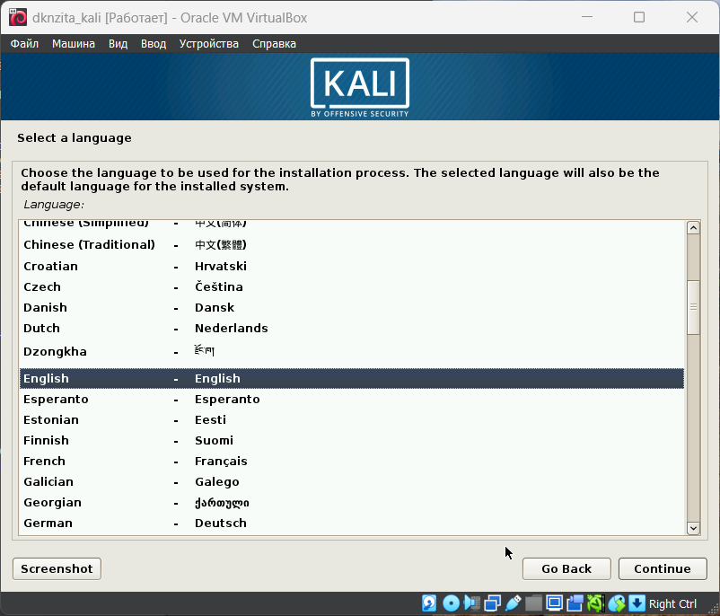{#fig:007 width=70%}

## Установка и настройка ОС

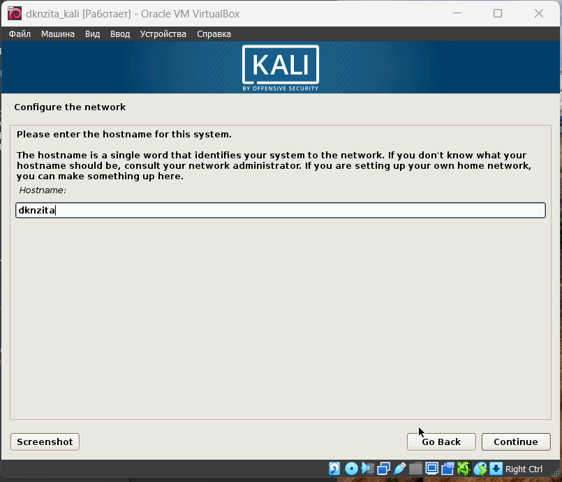{#fig:008 width=70%}

## Установка и настройка ОС

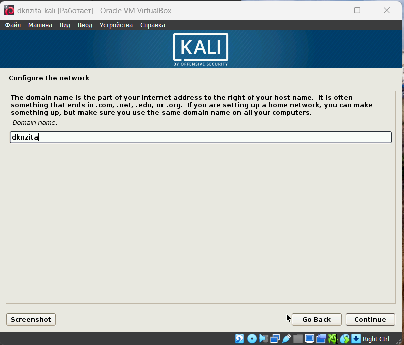{#fig:009 width=55%}

## Установка и настройка ОС

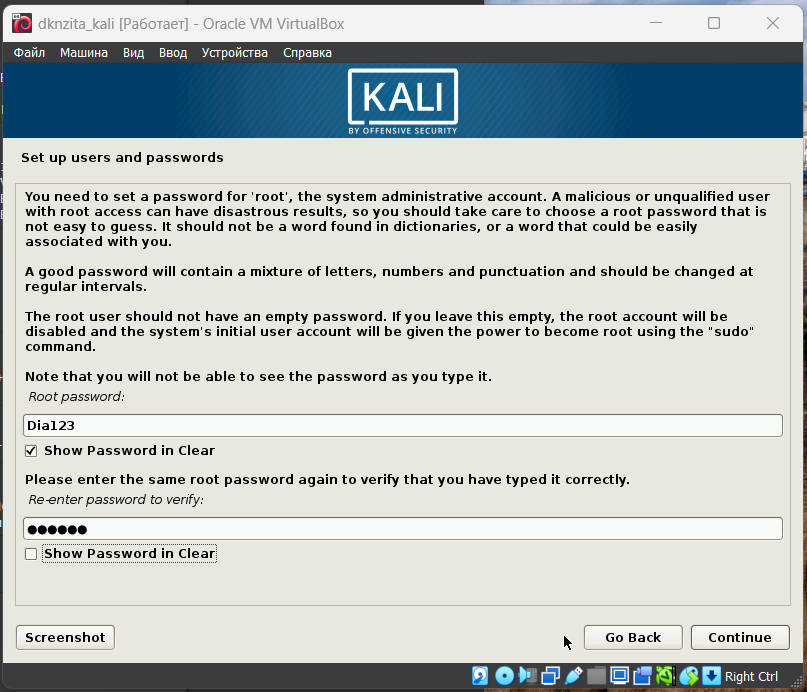{#fig:010 width=70%}

## Установка и настройка ОС

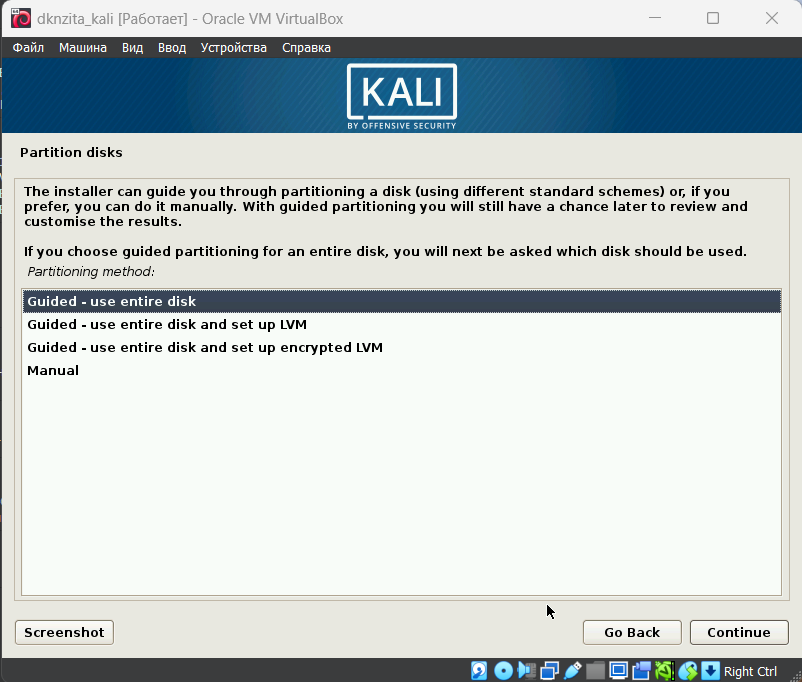{#fig:011 width=55%}

## Установка и настройка ОС

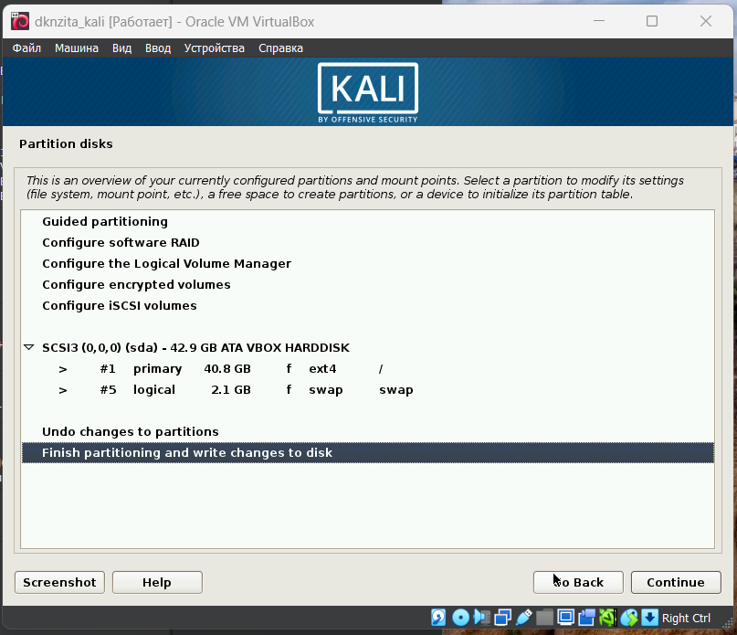{#fig:012 width=55%}

## Установка и настройка ОС

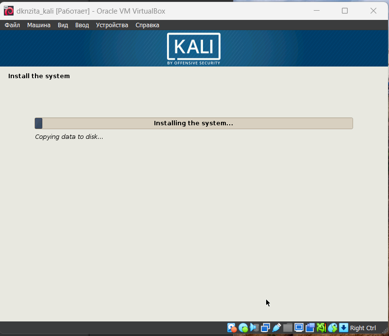{#fig:013 width=70%}

## Установка и настройка ОС

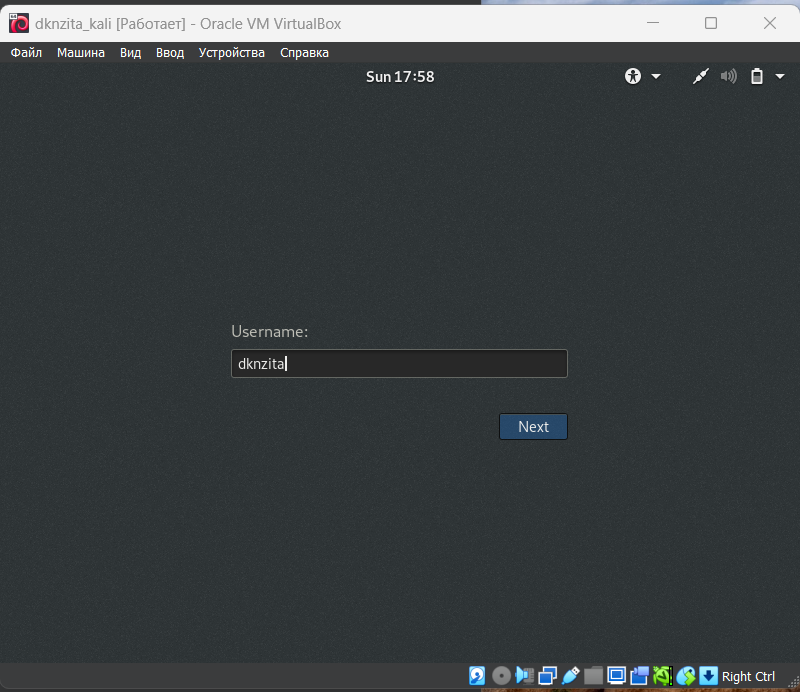{#fig:014 width=70%}

## Установка и настройка ОС

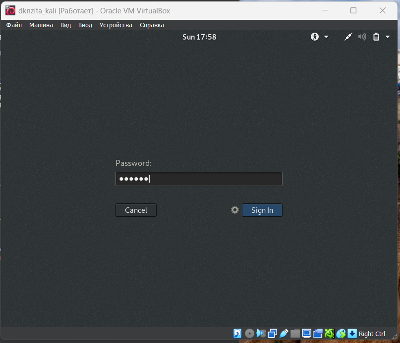{#fig:015 width=70%}

## Установка и настройка ОС

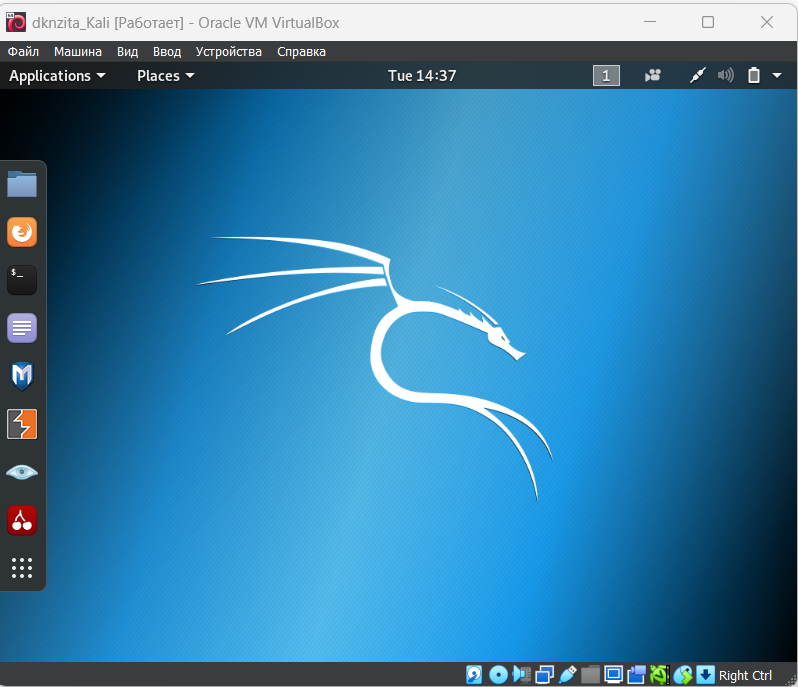{#fig:016 width=70%}

# Заключение

## Выводы

В результате выпольнения работы был установлен дистрибутив Kali Linux в виртуальную машину.

## Список литературы

1. VirtualBox [Электронный ресурс]. Oracler, 2024. URL: https://www.virtualbox.org/.
2. Kali Linux [Электронный ресурс]. OffSec Services Limited 2024, 2024. URL: https://www.kali.org/.

