---
# Front matter
lang: ru-RU
title: "Основы информационной безопасности"
subtitle: "Индивидуальный проект. Этап №1. установка Kali Linux"

author: Нзита Диатезилуа Катенди

# Formatting
toc-title: "Содержание"
toc: true # Table of contents
toc_depth: 2
lof: true # List of figures
fontsize: 12pt
linestretch: 1.5
papersize: a4paper
documentclass: scrreprt
polyglossia-lang: russian
polyglossia-otherlangs: english
mainfont: PT Serif
romanfont: PT Serif
sansfont: PT Sans
monofont: PT Mono
mainfontoptions: Ligatures=TeX
romanfontoptions: Ligatures=TeX
sansfontoptions: Ligatures=TeX,Scale=MatchLowercase
monofontoptions: Scale=MatchLowercase
indent: true
pdf-engine: lualatex
header-includes:
  - \linepenalty=10 # the penalty added to the badness of each line within a paragraph (no associated penalty node) Increasing the υalue makes tex try to haυe fewer lines in the paragraph.
  - \interlinepenalty=0 # υalue of the penalty (node) added after each line of a paragraph.
  - \hyphenpenalty=50 # the penalty for line breaking at an automatically inserted hyphen
  - \exhyphenpenalty=50 # the penalty for line breaking at an explicit hyphen
  - \binoppenalty=700 # the penalty for breaking a line at a binary operator
  - \relpenalty=500 # the penalty for breaking a line at a relation
  - \clubpenalty=150 # extra penalty for breaking after first line of a paragraph
  - \widowpenalty=150 # extra penalty for breaking before last line of a paragraph
  - \displaywidowpenalty=50 # extra penalty for breaking before last line before a display math
  - \brokenpenalty=100 # extra penalty for page breaking after a hyphenated line
  - \predisplaypenalty=10000 # penalty for breaking before a display
  - \postdisplaypenalty=0 # penalty for breaking after a display
  - \floatingpenalty = 20000 # penalty for splitting an insertion (can only be split footnote in standard LaTeX)
  - \raggedbottom # or \flushbottom
  - \usepackage{float} # keep figures where there are in the text
  - \floatplacement{figure}{H} # keep figures where there are in the text
---

# Постановка задачи

Целью данной работы является установка дистрибутика Kali Linux в виртуальную машину.

# Выполнение лабораторной работы

Проверим в свойства VirtualBox[@vb:bash] месторасположение каталога для виртуальных машин. Для этого в в VirtualBox выберем Файл -> Настройки, вкладка Общие. В поле  Папка для машин зададим /var/tmp/dknzita (рис. @fig:001)

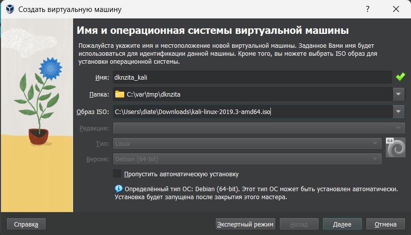{#fig:001 width=70%}

Скачаем образ Kali Linux [@vb:bash]. Создадим виртуальную машину. Добавим новый привод оптических дисков и выберите образ операционной системы, укажем имя виртуальной машины, тип операционной системы -- Linux, Debian (64-bit), рамзер основной памяти  -- 2048 МБ,  конфигурацию жёсткого диска — загрузочный, VDI (BirtualBox Disk Image), динамический виртуальный диск,  размер диска — 40 ГБ (или больше), его расположение -- в данном случае

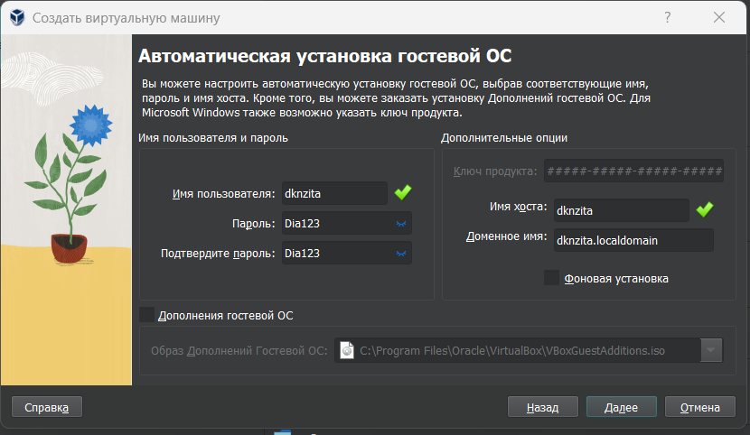{#fig:002 width=70%}

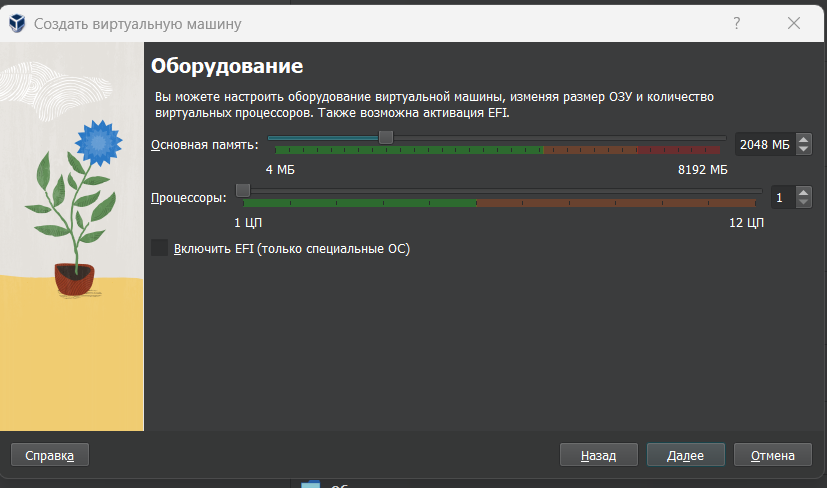{#fig:003 width=70%}

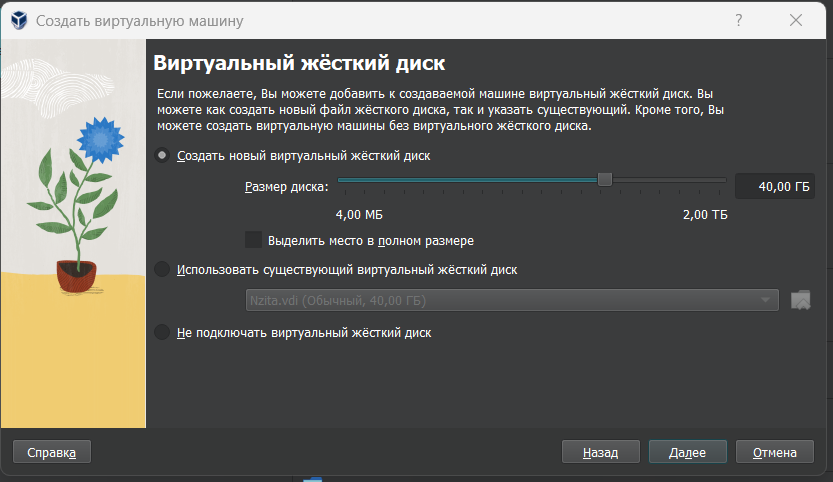{#fig:004 width=70%}

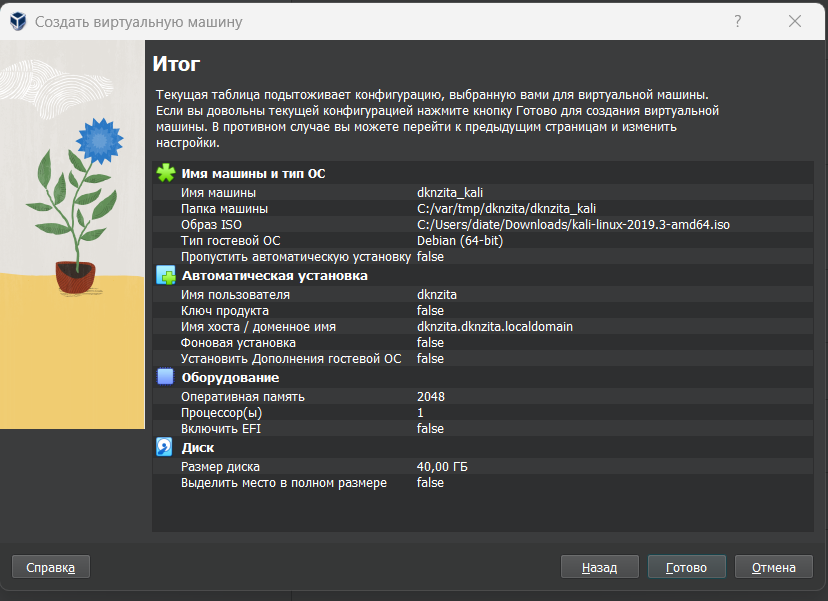{#fig:005 width=70%}

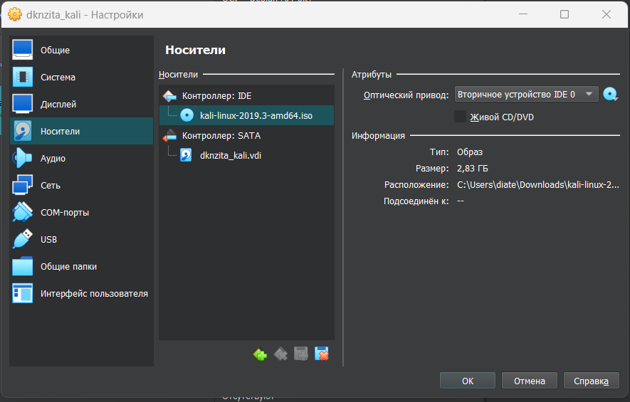{#fig:006 width=70%}

Запустим виртуальную машину, выреберем English в качестве языка интерфейса, дополнительно добавим русский язык и установим комбинацию клавиш для смены раскладки(рис. @fig:007)

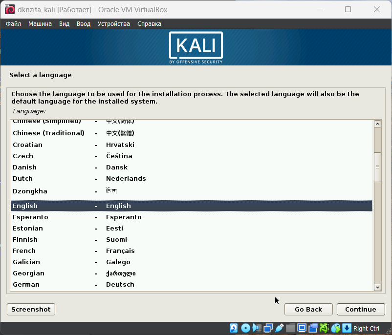{#fig:007 width=70%}

Установим имя хоста, пользователя и пароль суперпользователя(рис. @fig:008 - @fig:010):

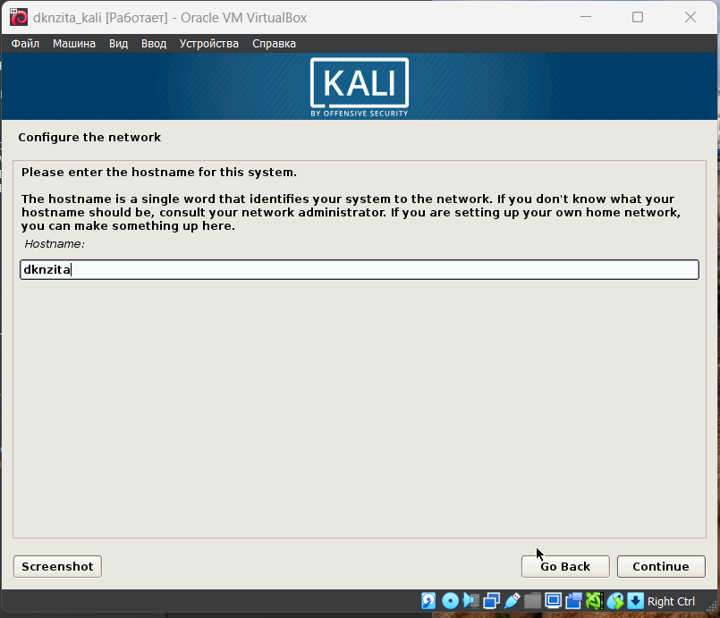{#fig:008 width=70%}

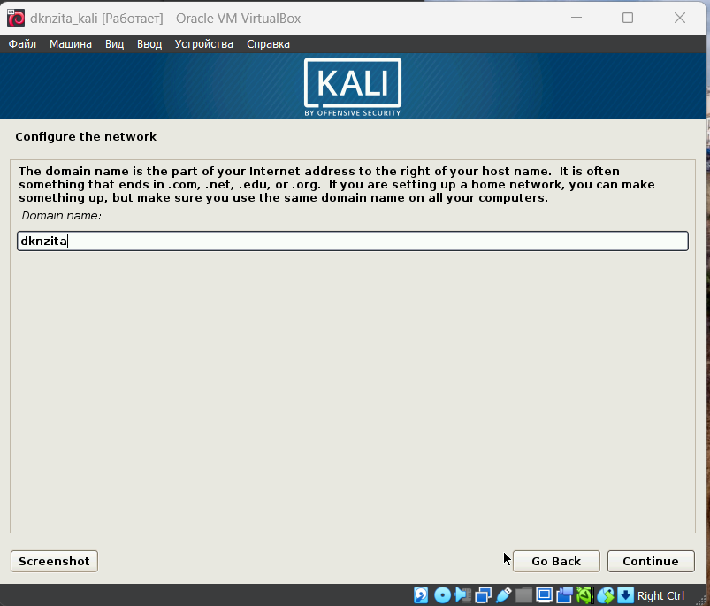{#fig:009 width=70%}

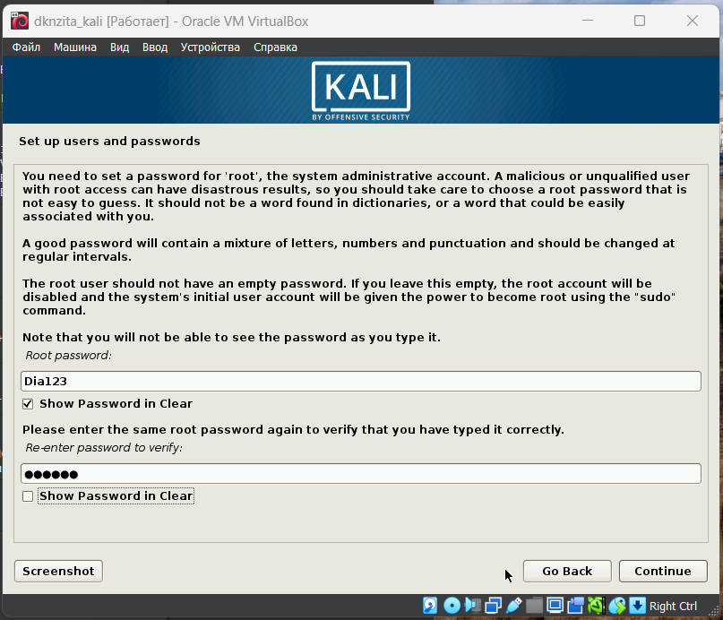{#fig:010 width=70%}

Установим пароль для root и пользователя с правами администратора(рис. @fig:011, @fig:012):

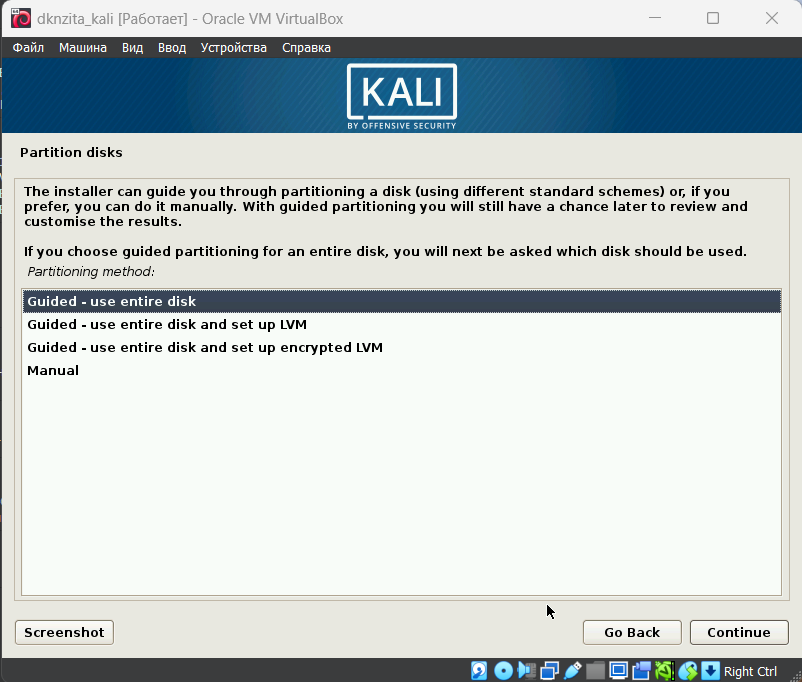{#fig:011 width=70%}

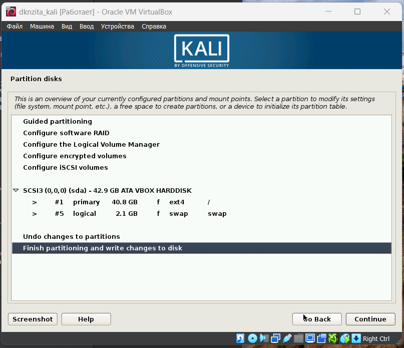{#fig:012 width=70%}

Выберем базовое ПО для начальной установки(рис. @fig:013):

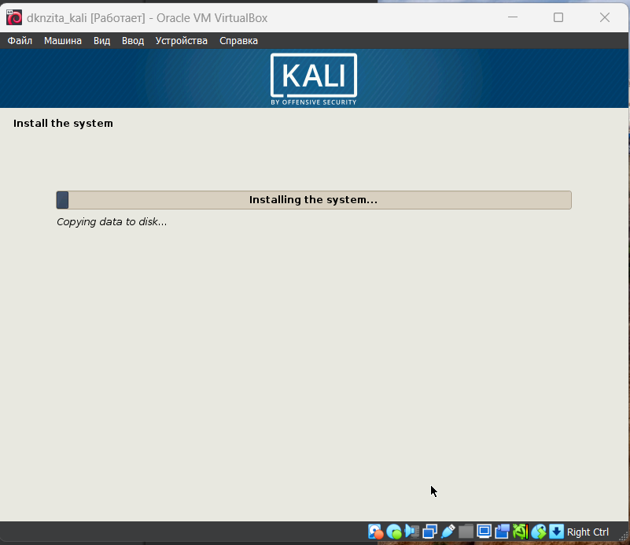{#fig:013 width=70%}

 Вход в акквунт (рис. @fig:014):

 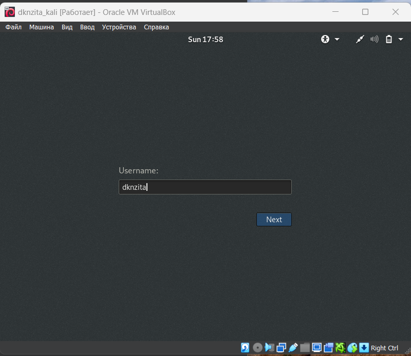{#fig:014 width=70%}

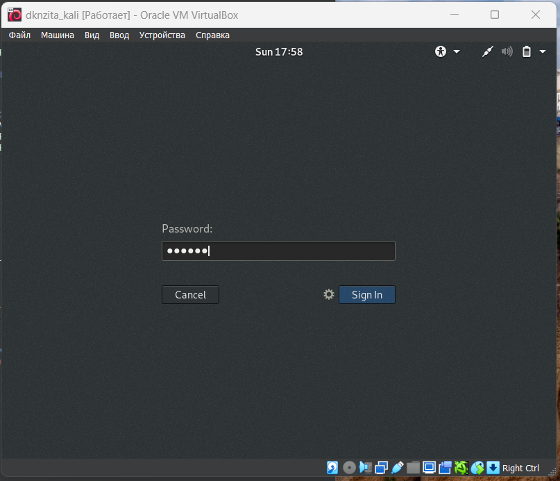{#fig:015 width=70%}

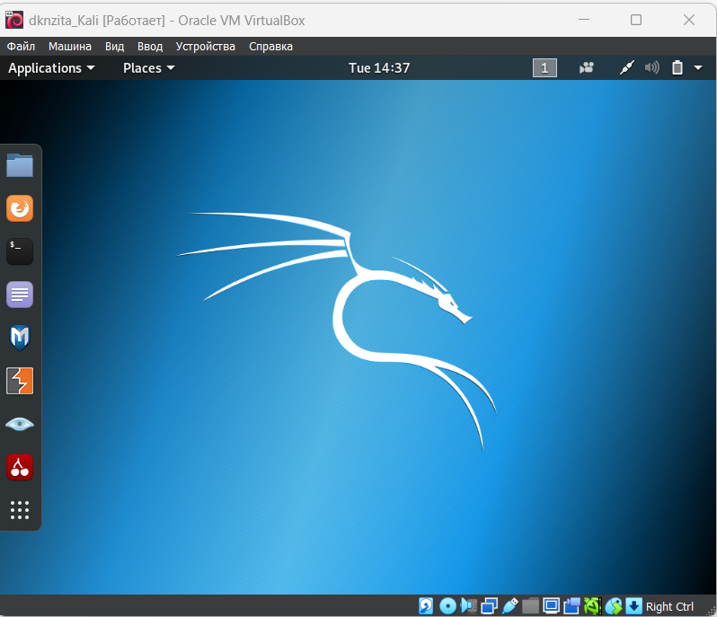{#fig:016 width=70%}

# Выводы

В результате выпольнения работы был установлен дистрибутив Kali Linux в виртальную машину.
# Список литературы{.unnumbered}
1.[Электроной ресурсов] https://www.kali.org/
::: {#refs}
:::

