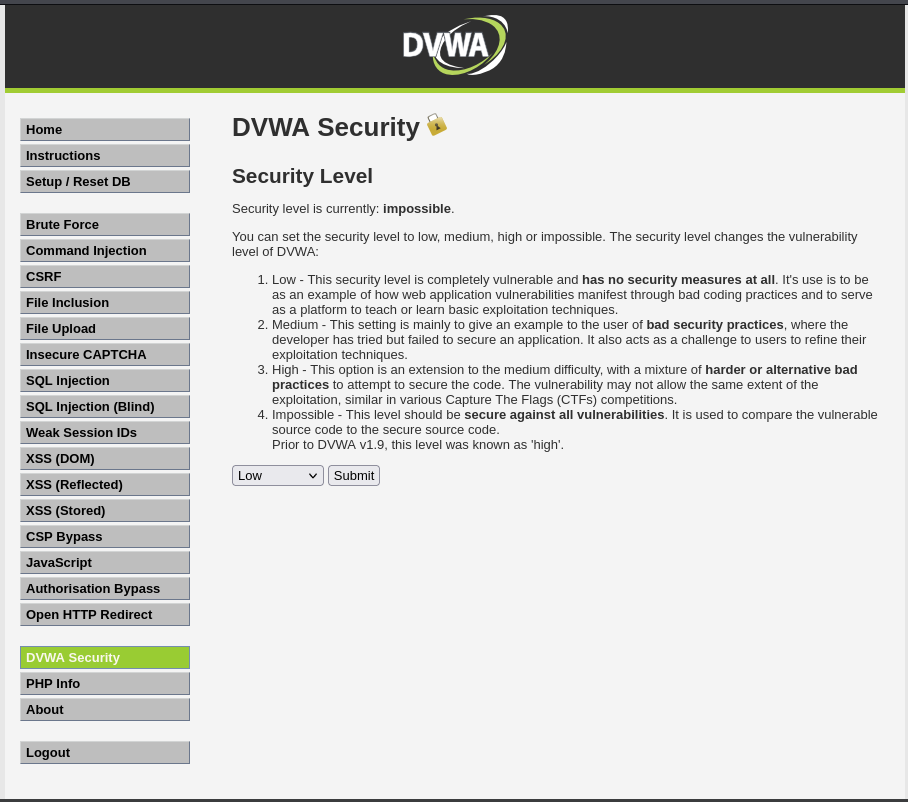
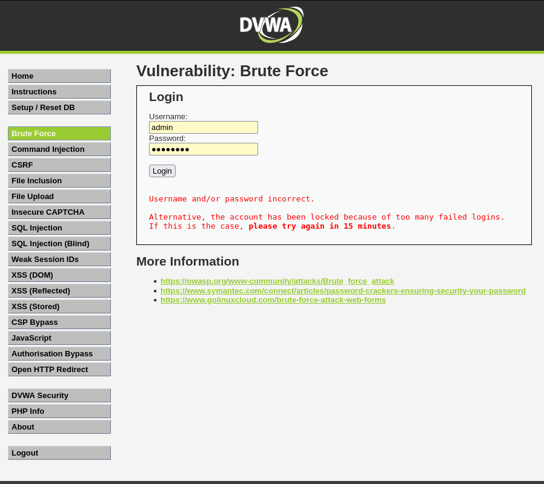
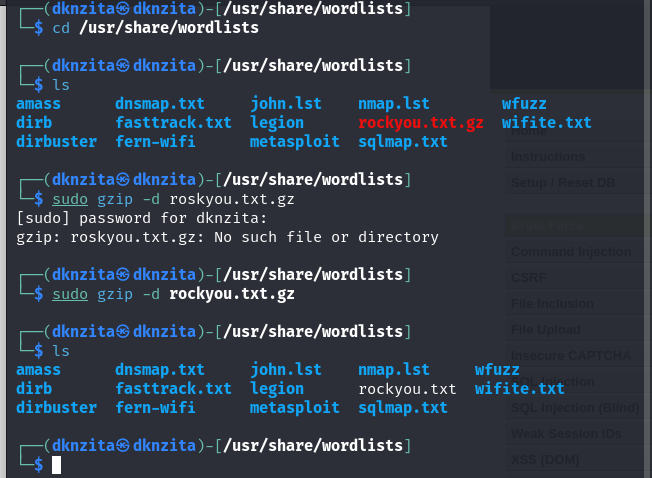
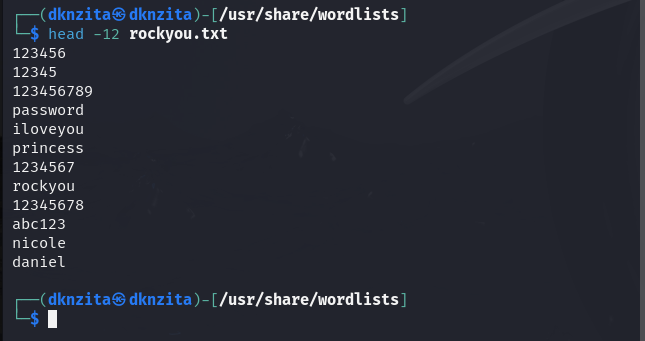
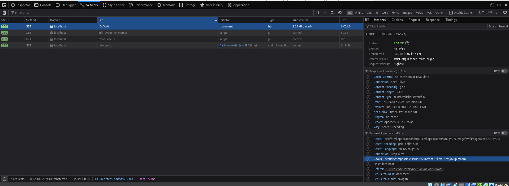
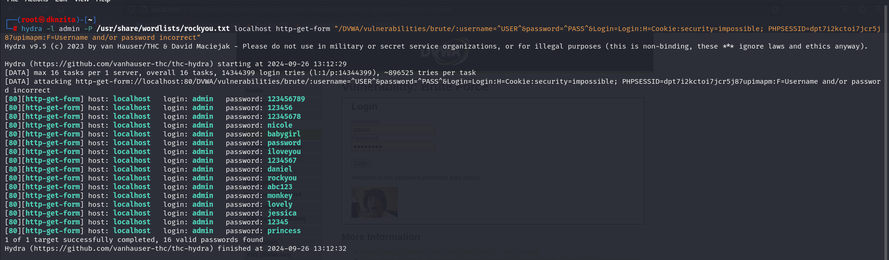
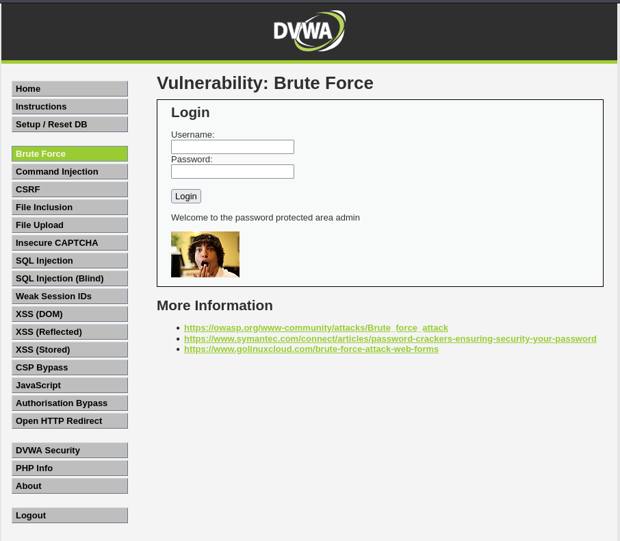

---
## Front matter
lang: ru-RU
title: "Основы информационной безопасности. Индивидуальный проект"
subtitle: Этап №3. Использование Hydra
author:
  - Нзита Диатезилуа Катенди
institute:
  - Российский университет дружбы народов, Москва, Россия
date: 27 сентября 2024 г.

## i18n babel
babel-lang: russian
babel-otherlangs: english

## Formatting pdf
toc: false
toc-title: Содержание
slide_level: 2
aspectratio: 169
section-titles: true
theme: metropolis
header-includes:
 - \metroset{progressbar=frametitle,sectionpage=progressbar,numbering=fraction}
---

# Информация

## Докладчик

:::::::::::::: {.columns align=center}
::: {.column width="70%"}

  * Нзита Диатезилуа Катенди
  * студент
  * Российский университет дружбы народов
  * [1032215220@pfur.ru](mailto:1032215220@pfur.ru)
  * <https://github.com/NzitaKatendi>

:::
::::::::::::::

# Вводная часть

## Цели и задачи

**Целью данной работы является использование Hydra для подбора пароля**

**Задачи:**

-  Подобрать пароль с помощью Hydra
**Инструмент:**  DVWA, Hydra

# Выполнение лабораторной работы

##  Настройка DVWA

{#fig:001 width=70%}

## Просмотр DVWA

{#fig:002 width=70%}

## Файл с паролями

{#fig:003 width=70%}

## Файл с паролями

{#fig:004 width=70%}
](image/4.png){#fig:004 width=70%}

## Просмотр DVWA

{#fig:005 width=70%}

## Brute force атака 

{#fig:006 width=70%}

## Brute force атака 

{#fig:007 width=70%}

# Заключение

## Выводы

В результате выпольнения работы была исполтзована Hydra для атаки типа brute force.

## Список литературы

1. DVWA [Электронный ресурс]. GitHub, Inc, 2024. URL: https://github.com/digininja/DVWA.
2. Подробное руководство по Hydra [Электронный ресурс]. CISOCLUB, 2024. URL: https://cisoclub.ru/podrobnoe-rukovodstvo-po-hydra/.
