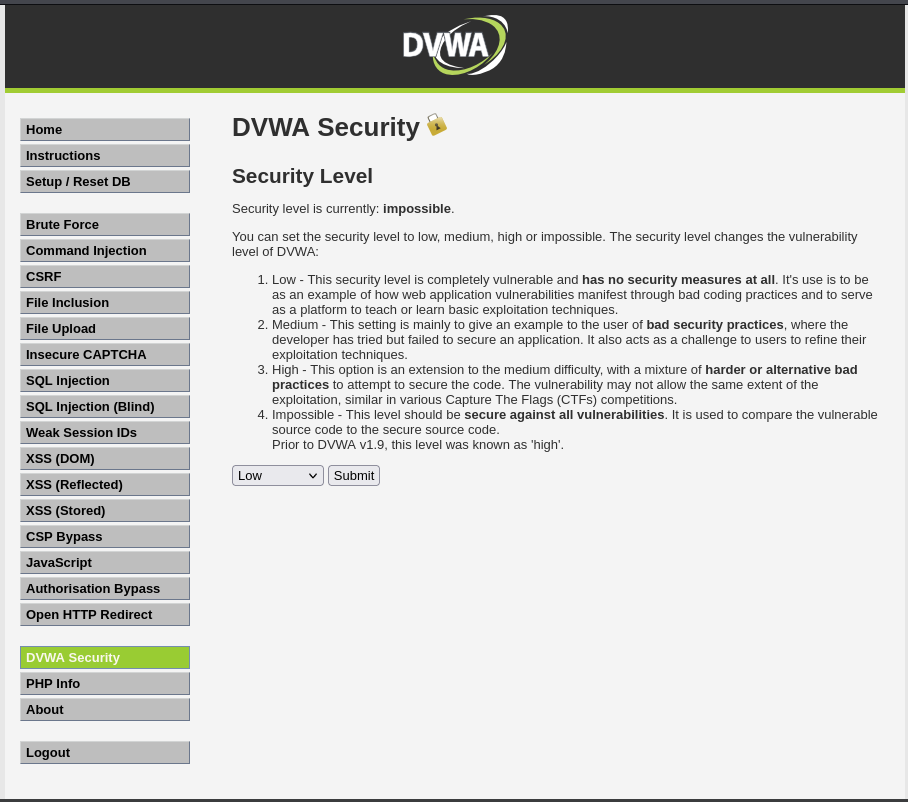
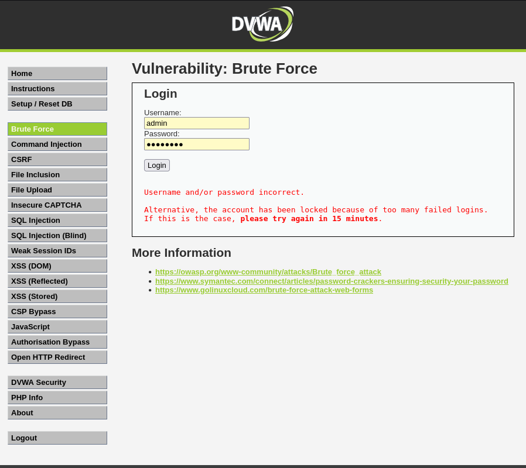
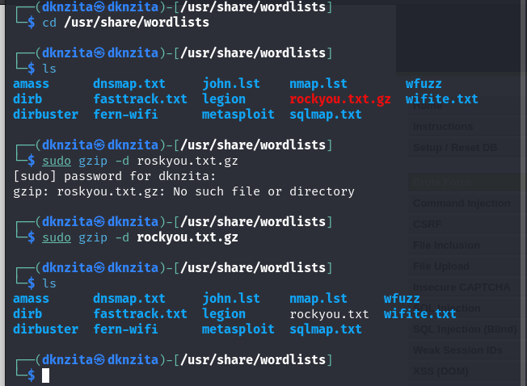
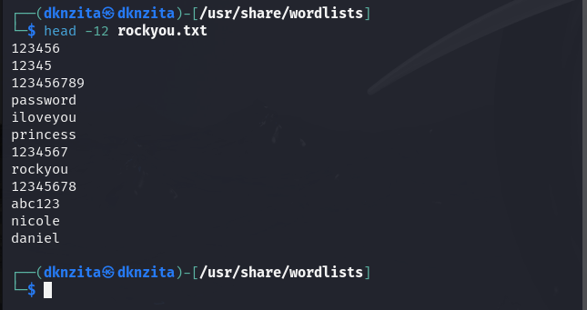

---
# Front matter
lang: ru-RU
title: "Основы информационной безопасности"
subtitle: "Индивидуальный проект. Этап №3.  Использование Hydra"

author: Нзита Диатезилуа Катенди

# Formatting
toc-title: "Содержание"
toc: true # Table of contents
toc_depth: 2
lof: true # List of figures
fontsize: 12pt
linestretch: 1.5
papersize: a4paper
documentclass: scrreprt
polyglossia-lang: russian
polyglossia-otherlangs: english
mainfont: PT Serif
romanfont: PT Serif
sansfont: PT Sans
monofont: PT Mono
mainfontoptions: Ligatures=TeX
romanfontoptions: Ligatures=TeX
sansfontoptions: Ligatures=TeX,Scale=MatchLowercase
monofontoptions: Scale=MatchLowercase
indent: true
pdf-engine: lualatex
header-includes:
  - \linepenalty=10 # the penalty added to the badness of each line within a paragraph (no associated penalty node) Increasing the υalue makes tex try to haυe fewer lines in the paragraph.
  - \interlinepenalty=0 # υalue of the penalty (node) added after each line of a paragraph.
  - \hyphenpenalty=50 # the penalty for line breaking at an automatically inserted hyphen
  - \exhyphenpenalty=50 # the penalty for line breaking at an explicit hyphen
  - \binoppenalty=700 # the penalty for breaking a line at a binary operator
  - \relpenalty=500 # the penalty for breaking a line at a relation
  - \clubpenalty=150 # extra penalty for breaking after first line of a paragraph
  - \widowpenalty=150 # extra penalty for breaking before last line of a paragraph
  - \displaywidowpenalty=50 # extra penalty for breaking before last line before a display math
  - \brokenpenalty=100 # extra penalty for page breaking after a hyphenated line
  - \predisplaypenalty=10000 # penalty for breaking before a display
  - \postdisplaypenalty=0 # penalty for breaking after a display
  - \floatingpenalty = 20000 # penalty for splitting an insertion (can only be split footnote in standard LaTeX)
  - \raggedbottom # or \flushbottom
  - \usepackage{float} # keep figures where there are in the text
  - \floatplacement{figure}{H} # keep figures where there are in the text
---

# Постановка задачи

  Целью данной работы являестся использование Hydra для подбора пароля.

# Теоретические сведения

Damn Vulnerable Web Application (DVWA) -- это веб-приложение PHP/MySQL, которое чертовски уязвимо[~@dvwa]. Его основная цель -- помочь специалистам по безопасности проверить свои навыки и инструменты в правовой среде, помочь веб-разработчикам лучше понять процессы обеспечения безопасности веб-приложений, а также помочь студентам и преподавателям узнать о безопасности веб-приложений в контролируемом классе. обстановка помещения.

DVWA (Damn Vulnerable Web Application) — это приложение, предназначенное для практики работы с распространёнными веб-уязвимостями, предлагая пользователю интуитивно понятный интерфейс. Оно содержит как документированные, так и недокументированные уязвимости, позволяя исследовать безопасность веб-приложений на разных уровнях сложности.

Некоторые из уязвимостей, представленных в DVWA, включают:

- **Брутфорс**: Атака на формы входа, используемая для тестирования инструментов, позволяющих подбирать пароли, и демонстрации уязвимости слабых паролей.
- **Выполнение команд**: Позволяет злоумышленнику исполнять команды на уровне операционной системы.
- **Межсайтовая подделка запроса (CSRF)**: Позволяет злоумышленнику изменять пароль администратора.
- **Внедрение файлов**: Злоумышленник может подключать удалённые или локальные файлы к веб-приложению.
- **SQL-внедрение**: Позволяет вставлять SQL-код в запросы через поля ввода, включая слепое и основанное на ошибках внедрение.
- **Небезопасная выгрузка файлов**: Позволяет загружать вредоносные файлы на сервер.
- **Межсайтовый скриптинг (XSS)**: Злоумышленник может внедрять свои скрипты в веб-приложение или базу данных, включая отражённые и сохранённые XSS.
- **Пасхальные яйца**: Раскрытие путей к файлам, обход аутентификации и другие уязвимости.

DVWA предлагает четыре уровня безопасности, которые меняют уязвимость веб-приложений:

- **Невозможный**: Уровень безопасности, при котором приложение защищено от всех уязвимостей. Используется для сравнения уязвимого кода с безопасным.
- **Высокий**: Уровень сложности с элементами более сложных и альтернативных плохих практик, который снижает возможности эксплуатации.
- **Средний**: Уровень, показывающий примеры плохих практик безопасности, где разработчик пытался обеспечить безопасность, но не смог.
- **Низкий**: Полностью уязвимый уровень, предназначенный для демонстрации плохих практик программирования и обучения базовым методам эксплуатации.

# Выполнение лабораторной работы

Установим самый низкий уровень защиты DVWA (рис. @fig:001)

{#fig:001 width=70%}

Откроем страницу для проведения атаки brute force, которая представляет собой простейшую уязвимую форму с паролем (рис. @fig:002).

{#fig:002 width=70%}

В Kali лежит файл с найболее популярными паролями,  который мы распакуем(рис. @fig:003).

{#fig:003 width=70%}

Можно увидеть, что уже в начале есть пароль, который установлен по умолчанию для нашего аккаунта(рис. @fig:004, @fig:005).

{#fig:004 width=70%}

Рассмотрим данные о запросе на вход(рис. @fig:005).

{#fig:005 width=70%}

Исходные данные:

- IP сервера 127.0.0.1(localhost);
- Сервис http на стандартном 80 порту;
- Для авторизации используется html форма, которая отправляет по адресу http://localhost/DVWA/vulnerabilities/brute методом GET запрос вида username=admin&password=test_password;
- В случае неудачной аутентификации пользователь наблюдает сообщение Username and/or password incorrect.

Запрос к Hydra будет выглядеть так(рис. @fig:006):

{#fig:006 width=70%}

В результате получим нужный пароль(рис. @fig:007):

{#fig:007 width=70%}

# Выводы

В результаты выпольнения работы была использована Hydra, для  атаки типа brute force.

# Список литературы{.unnumbered}
::::::
:::

