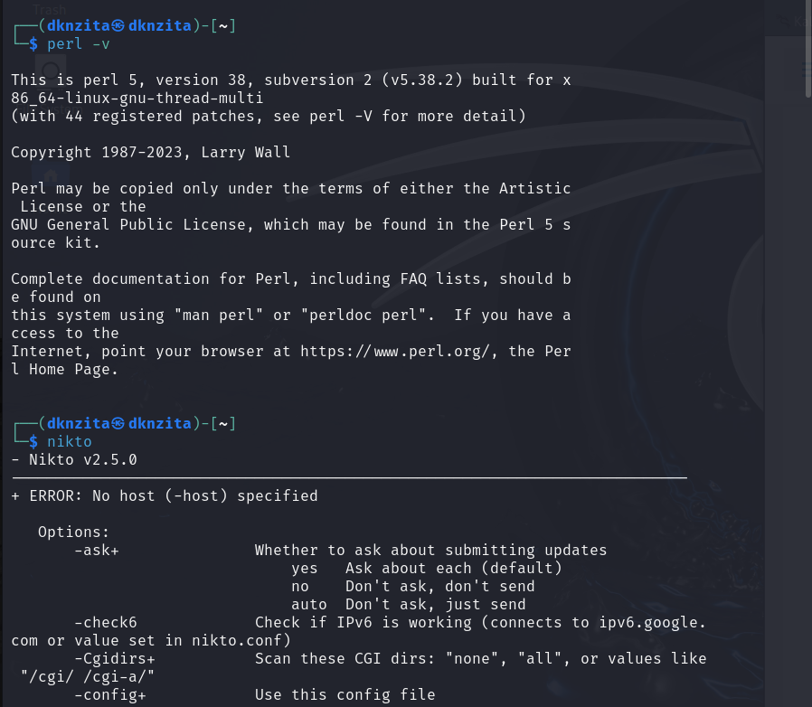
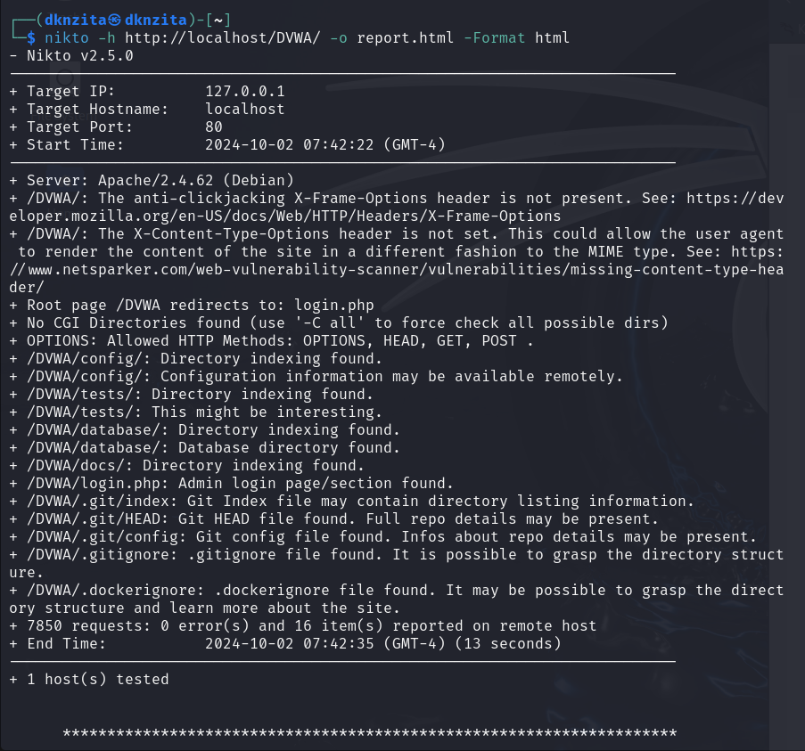
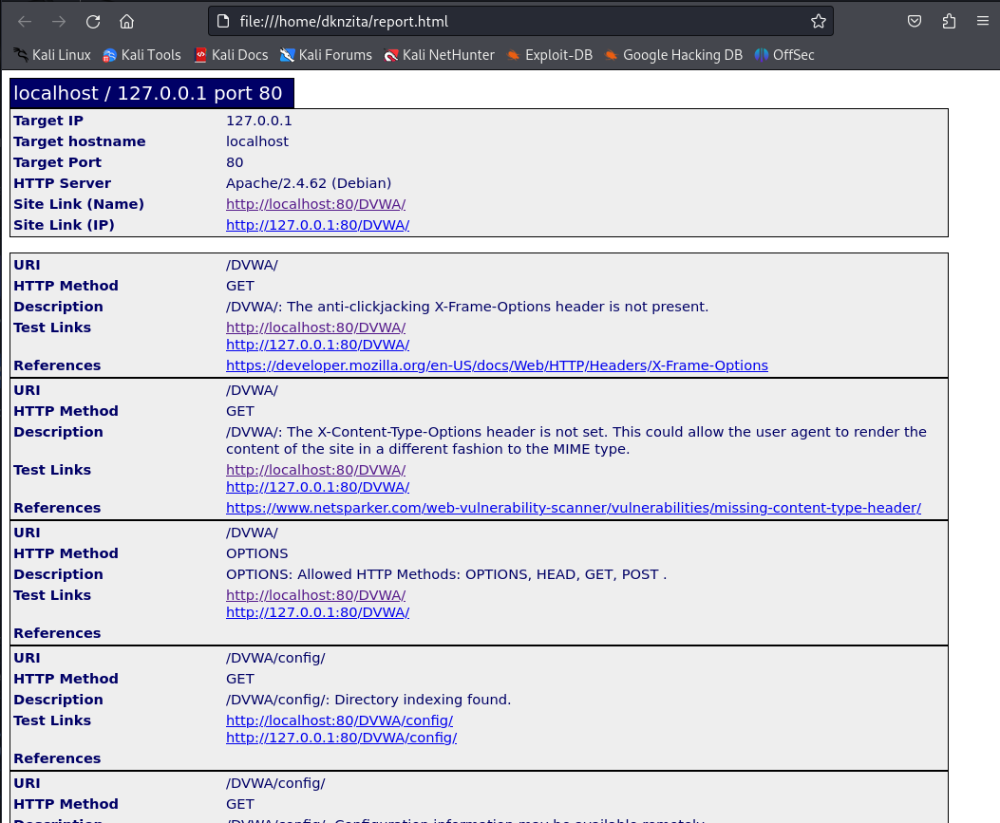
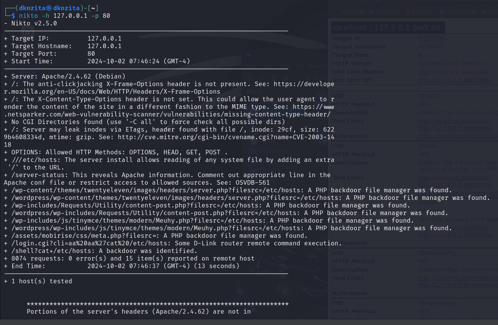

---
## Front matter
lang: ru-RU
title: "Основы информационной безопасности. Индивидуальный проект"
subtitle: Этап № 4. Использование nikto
author:
  - Нзита Диатезилуа Катенди
institute:
  - Российский университет дружбы народов, Москва, Россия
date: 27 сентября 2024 г.

## i18n babel
babel-lang: russian
babel-otherlangs: english

## Formatting pdf
toc: false
toc-title: Содержание
slide_level: 2
aspectratio: 169
section-titles: true
theme: metropolis
header-includes:
 - \metroset{progressbar=frametitle,sectionpage=progressbar,numbering=fraction}
---

# Информация

## Докладчик

:::::::::::::: {.columns align=center}
::: {.column width="70%"}

  * Нзита Диатезилуа Катенди
  * студент
  * Российский университет дружбы народов
  * [1032215220@pfur.ru](mailto:1032215220@pfur.ru)
  * <https://github.com/NzitaKatendi>

:::
::::::::::::::

# Вводная часть

## Цели и задачи

**Целью** данной работы является Nikto сканирования уязвимостей веб-приложения.

**Задачи:**

- Проанализировать уязвимости веб-приложения DVWA с помощью сканера Nikto.

**Инструмент:**  DVWA, Nikto

# Выполнение лабораторной работы

## Установка

{#fig:001 width=70%}

## Сканирование и анализ

{#fig:002 width=70%}

## Сканирование и анализ

{#fig:003 width=70%}

## Сканирование и анализ

{#fig:004 width=70%}

# Заключение

## Выводы

В результате выпольнения работы был использован сканер Nikto для сканирования уязвимостей веб-приложения.

## Список литературы

1. DVWA [Электронный ресурс]. GitHub, Inc, 2024. URL: https://github.com/digininja/DVWA.
2. Обзор сканера Nikto для поиска уязвимостей в веб-серверах [Электронный ресурс]. 2006–2024, Habr, 2023. URL: https://habr.com/ru/companies/first/articles/731696/.
