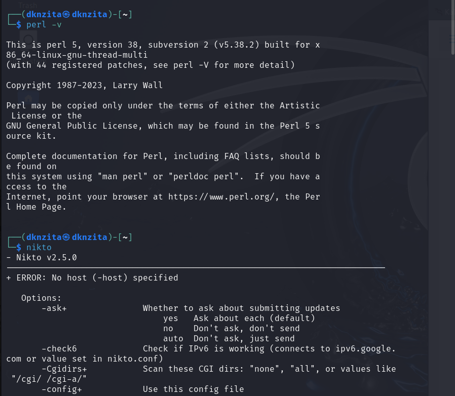
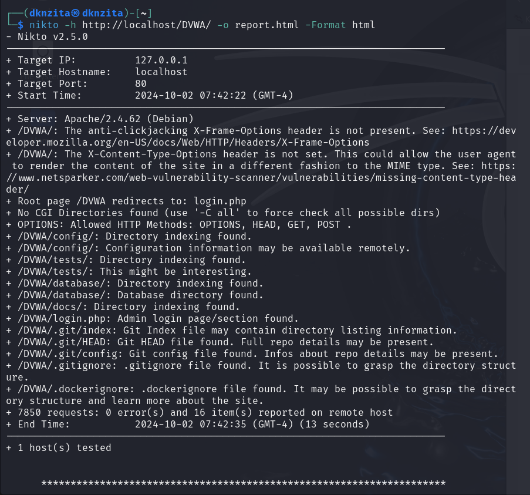
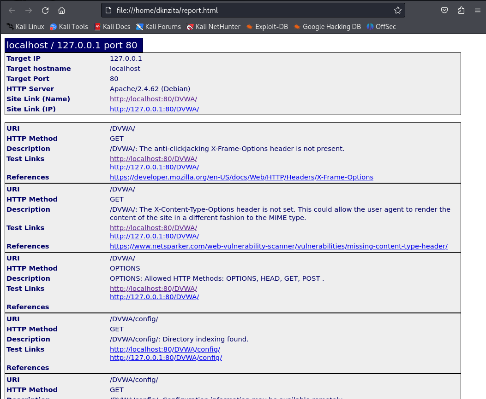
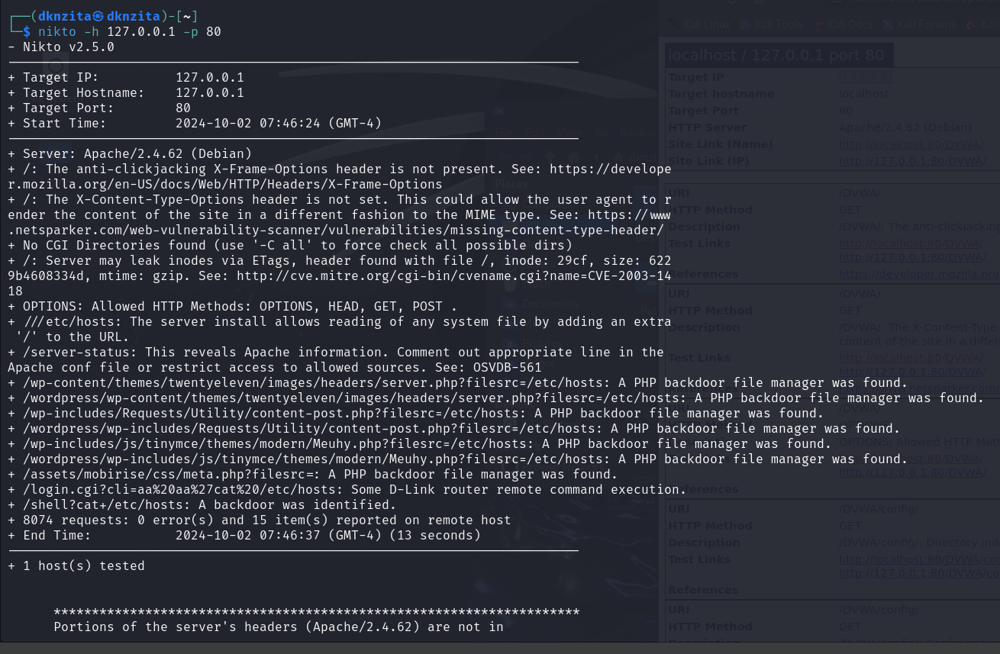

---
# Front matter
lang: ru-RU
title: "Основы информационной безопасности"
subtitle: "Индивидуальный проект. Этап № 4.   Использование nikto"

author: Нзита Диатезилуа Катенди

# Formatting
toc-title: "Содержание"
toc: true # Table of contents
toc_depth: 2
lof: true # List of figures
fontsize: 12pt
linestretch: 1.5
papersize: a4paper
documentclass: scrreprt
polyglossia-lang: russian
polyglossia-otherlangs: english
mainfont: PT Serif
romanfont: PT Serif
sansfont: PT Sans
monofont: PT Mono
mainfontoptions: Ligatures=TeX
romanfontoptions: Ligatures=TeX
sansfontoptions: Ligatures=TeX,Scale=MatchLowercase
monofontoptions: Scale=MatchLowercase
indent: true
pdf-engine: lualatex
header-includes:
  - \linepenalty=10 # the penalty added to the badness of each line within a paragraph (no associated penalty node) Increasing the υalue makes tex try to haυe fewer lines in the paragraph.
  - \interlinepenalty=0 # υalue of the penalty (node) added after each line of a paragraph.
  - \hyphenpenalty=50 # the penalty for line breaking at an automatically inserted hyphen
  - \exhyphenpenalty=50 # the penalty for line breaking at an explicit hyphen
  - \binoppenalty=700 # the penalty for breaking a line at a binary operator
  - \relpenalty=500 # the penalty for breaking a line at a relation
  - \clubpenalty=150 # extra penalty for breaking after first line of a paragraph
  - \widowpenalty=150 # extra penalty for breaking before last line of a paragraph
  - \displaywidowpenalty=50 # extra penalty for breaking before last line before a display math
  - \brokenpenalty=100 # extra penalty for page breaking after a hyphenated line
  - \predisplaypenalty=10000 # penalty for breaking before a display
  - \postdisplaypenalty=0 # penalty for breaking after a display
  - \floatingpenalty = 20000 # penalty for splitting an insertion (can only be split footnote in standard LaTeX)
  - \raggedbottom # or \flushbottom
  - \usepackage{float} # keep figures where there are in the text
  - \floatplacement{figure}{H} # keep figures where there are in the text
---

# Постановка задачи

Целью данной работы является использование Nikto для сканирования уязвимостей веб-приложения.

# Теоретические сведения

Damn Vulnerable Web Application (DVWA) — это веб-приложение PHP/MySQL, которое чертовски уязвимо[~@dvwa]. Его главная цель — помочь специалистам по безопасности проверить свои навыки и инструменты в правовой среде, помочь веб-разработчикам лучше понять процессы безопасности веб-приложений и помочь студентам и преподавателям узнать о безопасности веб-приложений в контролируемом классе. мебель для спальни.

Цель DVWA — устранить некоторые из наиболее распространенных веб-уязвимостей разного уровня сложности с помощью простого и интуитивно понятного интерфейса. В этом программном обеспечении есть как задокументированные, так и недокументированные уязвимости.

DVWA имеет три уровня безопасности, они изменяют уровень безопасности каждого веб-приложения в DVWA:

- Невозможно — этот уровень должен быть защищен от всех уязвимостей. Он используется для сравнения уязвимого исходного кода с безопасным исходным кодом.
- Высокий — это расширение среднего уровня сложности с комбинацией более сложных плохих практик или обходных путей в попытке защитить код. Уязвимости не допускают такого широкого спектра эксплуатации, как на других уровнях.
- Средний - Этот уровень безопасности в первую очередь предназначен для того, чтобы предоставить пользователю пример плохой практики безопасности, когда разработчик пытался защитить приложение, но потерпел неудачу.
- Низкий - Этот уровень безопасности полностью уязвим и не имеет никакой защиты. Его цель - быть примером уязвимых веб-приложений, примером плохой практики программирования и служить платформой для обучения основным методам эксплуатации.

Nikto - это бесплатный (с открытым исходным кодом) сканер для поиска уязвимостей в веб-серверах [~@nikto].

В начале сканирования всегда отображается следующий блок информации:

- Целевой IP: IP-адрес сканируемого домена.
- Целевое имя хоста: имя хоста (доменное имя) сканируемого веб-сайта;
- Целевой порт: порт, на котором расположен веб-сайт;
- Время начала: дата и время начала сканирования в формате год-месяц-день час:минута:секунда.

Вывод результатов сканирования имеет несколько форматов:

1. Формат: Тип компонента веб-сайта: Имя компонента. Пример: Сервер: nginx.
2. Описание: Nikto может определить, какие компоненты использует веб-сайт. Сюда входит имя веб-сервера, используемая СУБД, фреймворки, языки программирования, а также их версии. Формат: путь к файлу/каталогу, где была обнаружена уязвимость: описание уязвимости. Пример: /phpinfo.php: Найден вывод функции phpinfo().

# Выполнение лабораторной работы

Проверим, что nikto установлен(рис. @fig:001)

{#fig:001 width=70%}

Затем проверим сайт DVWA, указав опции для сохранения отчета в формате html(рис. @fig:002, ).

{#fig:002 width=70%}

{#fig:003 width=70%}

Можем увидеть, что найдены такие уязвимости как отсутствие защиты от кликджекинга, не установлен заголовок X-Content-Type-Options(в связи с чем пользователь может выполнить вредоносный контент не того типа, который предполагает администратор), возможность удаленного доступа к файлам конфигураций, также найдена скрытая папка git, в которой хранятся данные о структуре сайта. Уязвимость типа `This might be interesting...` означает, что необходимо дополнительная ручная проверка(скорей всего это незначительная уязвимость раскрытия информации -- доступен просмотр файлов каталога). В конце отчета указано, что найдено 16 уязвимостей.

Также можно посмотреть информацию об уязвимостях по конкретному порту(в нашем случае порт 80 для локального хоста)(рис. @fig:004).

{#fig:004 width=70%}

# Выводы

В результате выпольнения работы использован сканер Nikto для сканирования уязвимостей веб-приложения.

# Список литературы{.unnumbered}
::::::
:::

