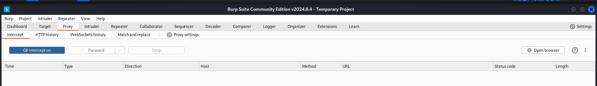

---
# Front matter
lang: ru-RU
title: "Основы информационной безопасности"
subtitle: "Индивидуальный проект. Этап № 5.  Использование Burp Suite"

author: Нзита Диатезилуа Катенди

# Formatting
toc-title: "Содержание"
toc: true # Table of contents
toc_depth: 2
lof: true # List of figures
fontsize: 12pt
linestretch: 1.5
papersize: a4paper
documentclass: scrreprt
polyglossia-lang: russian
polyglossia-otherlangs: english
mainfont: PT Serif
romanfont: PT Serif
sansfont: PT Sans
monofont: PT Mono
mainfontoptions: Ligatures=TeX
romanfontoptions: Ligatures=TeX
sansfontoptions: Ligatures=TeX,Scale=MatchLowercase
monofontoptions: Scale=MatchLowercase
indent: true
pdf-engine: lualatex
header-includes:
  - \linepenalty=10 # the penalty added to the badness of each line within a paragraph (no associated penalty node) Increasing the υalue makes tex try to haυe fewer lines in the paragraph.
  - \interlinepenalty=0 # υalue of the penalty (node) added after each line of a paragraph.
  - \hyphenpenalty=50 # the penalty for line breaking at an automatically inserted hyphen
  - \exhyphenpenalty=50 # the penalty for line breaking at an explicit hyphen
  - \binoppenalty=700 # the penalty for breaking a line at a binary operator
  - \relpenalty=500 # the penalty for breaking a line at a relation
  - \clubpenalty=150 # extra penalty for breaking after first line of a paragraph
  - \widowpenalty=150 # extra penalty for breaking before last line of a paragraph
  - \displaywidowpenalty=50 # extra penalty for breaking before last line before a display math
  - \brokenpenalty=100 # extra penalty for page breaking after a hyphenated line
  - \predisplaypenalty=10000 # penalty for breaking before a display
  - \postdisplaypenalty=0 # penalty for breaking after a display
  - \floatingpenalty = 20000 # penalty for splitting an insertion (can only be split footnote in standard LaTeX)
  - \raggedbottom # or \flushbottom
  - \usepackage{float} # keep figures where there are in the text
  - \floatplacement{figure}{H} # keep figures where there are in the text
---

# Постановка задачи

 Целью данной работы является использование Burp Suite для перехвата, изменения и изучения  HTTP запросов и ответов.

# Теоретические сведения

Damn Vulnerable Web Application (DVWA) — это чрезвычайно уязвимое веб-приложение PHP/MySQL[~@dvwa]. Его основная цель — помочь специалистам по безопасности проверить свои навыки и инструменты в юридической среде, помочь веб-разработчикам лучше понять процессы безопасности веб-приложений, а также помочь студентам и преподавателям узнать о безопасности веб-приложений в контролируемой среде класса.

Цель DVWA — устранить некоторые наиболее распространенные веб-уязвимости различного уровня сложности с помощью простого и понятного интерфейса. В этом программном обеспечении имеются документированные и недокументированные уязвимости.

DVWA имеет три уровня безопасности, они меняют уровень безопасности каждого веб-приложения в DVWA:

- Невозможно. Этот уровень должен быть защищен от всех уязвимостей. Он используется для сравнения уязвимого исходного кода с безопасным исходным кодом.

- Высокий. Это расширение среднего уровня сложности с сочетанием более сложных или альтернативных плохих методов в попытке защитить код. Уязвимости не допускают такого широкого использования, как на других уровнях.

- Средний. Этот уровень безопасности в первую очередь предназначен для того, чтобы дать пользователю пример плохих методов обеспечения безопасности, когда разработчик пытался обеспечить безопасность приложения, но потерпел неудачу.

- Низкий – этот уровень безопасности полностью уязвим и не имеет защиты. Он призван стать примером уязвимых веб-приложений, примером плохих методов программирования и служить платформой для изучения основных методов эксплуатации.

Burp Suite — интегрированная платформа для тестирования безопасности веб-приложений в ручном и автоматическом режимах[~@bs].

Пакет состоит из набора утилит, включая инструменты для сбора и анализа информации, моделирования различных типов атак, перехвата запросов и ответов от сервера и т.д.

- Target – создает карту сайта с подробной информацией о тестируемом приложении. Показывает, какие цели тестируются, и позволяет управлять процессом обнаружения уязвимостей.

- Прокси – находится между браузером пользователя и тестируемым веб-приложением. Он перехватывает все сообщения, передаваемые по протоколу HTTP(S).

- Spider – автоматически собирает данные о функциях и компонентах веб-приложения.
- Clickbandit – имитирует кликджекинг-атаки, при которых поверх страницы приложения загружается невидимая страница, подготовленная злоумышленниками.

— DOM Invader — проверяет веб-приложение на уязвимость к межсайтовому скриптингу на основе DOM (на основе объектной модели документа), внедряя на страницу вредоносный код.

- Сканер (в профессиональной и корпоративной редакциях) — автоматически сканирует веб-приложения на наличие уязвимостей. Он также существует в бесплатной версии, но там представлено лишь описание возможностей.

Intrumer – осуществляет автоматические атаки различных типов, от перебора открытых веб-каталогов до SQL-инъекций.

— Повторитель — утилита для ручного манипулирования и перевыпуска отдельных HTTP-запросов и анализа ответов приложений. Запрос в Повторитель можно отправить из любой другой утилиты Burp Suite.

- Секвенсор – анализирует качество случайности в выборке элементов данных. Его можно использовать для тестирования токенов сеанса приложения или других важных элементов данных, которые, как ожидается, будут непредсказуемыми, таких как токены защиты от CSRF, токены сброса пароля и т. д.

Декодер — преобразует закодированные данные в исходный формат или необработанные данные в различные хешированные и закодированные форматы. Вы можете распознавать различные форматы кодирования с помощью эвристики.

Компаратор — обеспечивает функцию визуального сравнения различий в данных.

# Выполнение лабораторной работы

Intercept HTTP traffic with Burp Proxy

Установим Burp Suit с официального сайта(рис. @fig:001)

{#fig:001 width=70%}

Откроем приложение и создадим временный проект с параметрами по умолчанию(рис. @fig:002).

{#fig:002 width=70%}

{#fig:003 width=70%}

Теперь попробуем перехватить http запрос с помощью Burp Proxy. Включим перехват, а в браузере включим прокси и укажем для него адрес локального хоста, а также установим параметр, разрешающий перехват запросов локального хоста(рис. @fig:004 - @fig:006).

{#fig:004 width=70%}

{#fig:005 width=70%}

{#fig:006 width=70%}

Можем увидеть первый перехваченный запрос: вход на сайт DVWA. Указаны адрес локального хоста, версия браузера, ОС устройства и другая информация(рис. @fig:007):

{#fig:007 width=70%}

Рассмотрим перехват запроса аутентификации(рис. @fig:008):

{#fig:008 width=70%}

Здесь дополнительно указываются куки запроса, а также выдается сам запрос с указанием введенного имени пользователя и пароля.

Кроме того уже совершенный запрос можно отпправить на повтор для того чтобы изучить ответы(рис. @fig:009):

{#fig:009 width=70%}

В запросах можно изменять вводимую нформацию и сравнивать ответы(рис. @fig:010):

{#fig:010 width=70%}

# Выводы

В результате выполнения работы научились на практике использовать ПО Burp Suit для перехвата, изменения и изучения HTTP запросов и ответов. 

# Список литературы{.unnumbered}
::::::
:::

