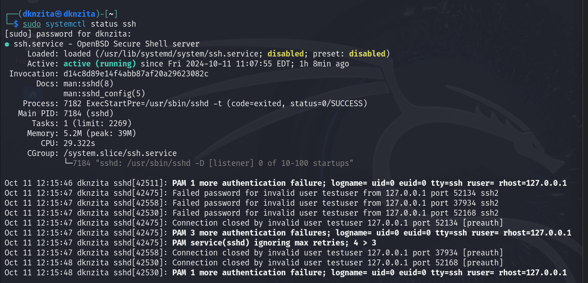

---
## Front matter
lang: ru-RU
title: Доклад
subtitle: "Идентификация и аутентификация, управление доступом"
author:
  - Нзита Диатезилуа Катенди
institute:
  - Российский университет дружбы народов, Москва, Россия
date: 11 октября 2024 г.

## i18n babel
babel-lang: russian
babel-otherlangs: english

## Formatting pdf
toc: false
toc-title: Содержание
slide_level: 2
aspectratio: 169
section-titles: true
theme: metropolis
header-includes:
 - \metroset{progressbar=frametitle,sectionpage=progressbar,numbering=fraction}
---

# Информация

## Докладчик

:::::::::::::: {.columns align=center}
::: {.column width="70%"}

  * Нзита Диатезилуа Катенди
  * студент
  * Российский университет дружбы народов
  * [1032215220@pfur.ru](mailto:1032215220@pfur.ru)
  * <https://github.com/NzitaKatendi>

:::
::::::::::::::

# Вводная часть

## Цели и задачи

**Целью** данной работы является механизмов идентификации и аутентификации пользователей в компьютерных системах, а также ознакомление с методами управления доступом к ресурсам. 

**Задачи:**

- Понять ключевые понятия идентификации, аутентификации и управления доступом.
- Рассмотреть современные методы и технологии.
- Показать примеры из практики.
- Сделать выводы о важности этих аспектов в ИТ-системах.

 **Инструмент** Kali Linuz, bash

# Выполнение лабораторной работы

##  Проверка статус службы SSH

{#fig:001 width=70%}

## Идентификация

{#fig:002 width=70%}

## Аутентификация

{#fig:003 width=70%}

## Процессы и технологии аутентификации

{#fig:004 width=70%}

## Настройка прав доступа к файлу

{#fig:005 width=70%}

## Управление доступом

{#fig:006 width=70%}

# Заключение

## Выводы

В ходе выполнения лабораторной работы были изучены основные механизмы идентификации и аутентификации пользователей, а также методы управления доступом к ресурсам информационных систем.

## Список литературы

1. Фредрикс, Дж. "Кибербезопасность: введение в управление доступом". Москва: Издательство "Наука", 2019.

2. Брук, Д. "Основы сетевой безопасности". СПб: Питер, 2020.

3. Документация Kali Linux: Официальное руководство. https://www.kali.org/docs/.
Руководство по использованию journalctl. https://man7.org/linux/man-pages/man1/journalctl.1.html.

4. Стандартная документация SSH. https://www.openssh.com/manual.html.

