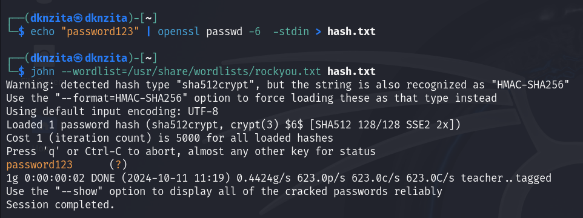

---
# Front matter
lang: ru-RU
title: "Информационная безопасность"
subtitle: "Идентификация и аутентификация, управление доступом"

author: "Нзита Диатезилуа Катенди"

# Formatting
toc-title: "Содержание"
toc: true # Table of contents
toc_depth: 2
lof: true # List of figures
fontsize: 12pt
linestretch: 1.5
papersize: a4paper
documentclass: scrreprt
polyglossia-lang: russian
polyglossia-otherlangs: english
mainfont: PT Serif
romanfont: PT Serif
sansfont: PT Sans
monofont: PT Mono
mainfontoptions: Ligatures=TeX
romanfontoptions: Ligatures=TeX
sansfontoptions: Ligatures=TeX,Scale=MatchLowercase
monofontoptions: Scale=MatchLowercase
indent: true
pdf-engine: lualatex
header-includes:
  - \linepenalty=10 # the penalty added to the badness of each line within a paragraph (no associated penalty node) Increasing the υalue makes tex try to haυe fewer lines in the paragraph.
  - \interlinepenalty=0 # υalue of the penalty (node) added after each line of a paragraph.
  - \hyphenpenalty=50 # the penalty for line breaking at an automatically inserted hyphen
  - \exhyphenpenalty=50 # the penalty for line breaking at an explicit hyphen
  - \binoppenalty=700 # the penalty for breaking a line at a binary operator
  - \relpenalty=500 # the penalty for breaking a line at a relation
  - \clubpenalty=150 # extra penalty for breaking after first line of a paragraph
  - \widowpenalty=150 # extra penalty for breaking before last line of a paragraph
  - \displaywidowpenalty=50 # extra penalty for breaking before last line before a display math
  - \brokenpenalty=100 # extra penalty for page breaking after a hyphenated line
  - \predisplaypenalty=10000 # penalty for breaking before a display
  - \postdisplaypenalty=0 # penalty for breaking after a display
  - \floatingpenalty = 20000 # penalty for splitting an insertion (can only be split footnote in standard LaTeX)
  - \raggedbottom # or \flushbottom
  - \usepackage{float} # keep figures where there are in the text
  - \floatplacement{figure}{H} # keep figures where there are in the text
---

# Цель работы

Целью данной работы являестся механизмов идентификации и аутентификации пользователей в компьютерных системах, а также ознакомление с методами управления доступом к ресурсам. 

# Теоретические сведения

## Идентификация ##

Идентификация – это процесс распознавания личности пользователя системой. При идентификации пользователь предоставляет уникальные данные, такие как имя пользователя, номер идентификационной карты или другой уникальный идентификатор, который позволяет системе определить, кто именно обращается к её ресурсам. Этот процесс не подтверждает достоверность предоставленной информации, а лишь служит для определения личности пользователя.

## Аутентификация ##

Аутентификация – это процесс подтверждения того, что пользователь действительно является тем, за кого себя выдает. Этот процесс следует после идентификации и предполагает проверку предоставленных пользователем данных. Существует несколько методов аутентификации:

Однофакторная аутентификация: Использование одного метода подтверждения, например, пароля.

Многофакторная аутентификация: Использование нескольких методов подтверждения, например, пароля и отпечатка пальца или смс-кода.

## Управление доступом ##

Управление доступом – это процесс регулирования прав и привилегий пользователей для доступа к ресурсам информационной системы. Существует несколько моделей управления доступом:

Дискреционное управление доступом (DAC): Доступ к ресурсам предоставляется владельцем ресурса на своё усмотрение.

Обязательное управление доступом (MAC): Доступ к ресурсам регулируется системой на основе заранее установленных политик безопасности.

Ролевая модель управления доступом (RBAC): Доступ к ресурсам предоставляется на основе ролей, назначенных пользователям.

## Журналы аутентификации ##

Журналы аутентификации – это записи, которые ведёт система для фиксации всех попыток входа пользователей, как успешных, так и неудачных. Анализ этих журналов позволяет выявлять подозрительные активности, такие как множественные неудачные попытки входа, что может свидетельствовать о попытках взлома или несанкционированного доступа. В операционных системах на базе Linux такие журналы обычно хранятся в файлах /var/log/auth.log или /var/log/secure.

# Выполнение лабораторной работы

Перед началом лабораторной работы необходимо убедиться, что служба SSH (Secure Shell) активна и настроена на вашем компьютере. SSH позволяет безопасно подключаться к системе удалённо и является распространённым инструментом для управления серверами. (рис. @fig:001)

{#fig:001 width=70%}

содержит информацию о пользователях системы. Каждая строка представляет одного пользователя с различными полями, такими как имя пользователя, UID, GID, домашний каталог и оболочка. (рис. @fig:002)

{#fig:002 width=70%}

После генерации неудачных попыток входа необходимо проанализировать системные журналы, чтобы убедиться в фиксации этих событий. (рис. @fig:003)

Эта команда выводит все записи о неудачных попытках входа в систему, что помогает отслеживать попытки несанкционированного доступа.

{#fig:003 width=70%}

## Процессы и технологии аутентификации ##

Современные методы:

- Биометрия (скан отпечатков пальцев, распознавание лица).
- Токены (одноразовые пароли, физические ключи).
- Протоколы (OAuth, SAML, Kerberos).

Создает SHA-512 хеш для пароля password123 и сохраняет его в файл hash.txt.

Использует словарь rockyou.txt для подбора пароля, соответствующего хешу в hash.txt (рис. @fig:004)

{#fig:004 width=70%}

Этот пример демонстрирует, как могут быть взломаны слабые пароли. Используйте его только на собственных тестовых системах и хешах.

## Управление доступом ##

Методы:

- DAC (Discretionary Access Control) – доступ на усмотрение владельца.
- MAC (Mandatory Access Control) – обязательный контроль доступа.
- RBAC (Role-Based Access Control) – контроль доступа на основе ролей.

Ограничение доступа к конфиденциальным документам в корпоративной сети на основе должностей

 Устанавливает права доступа к файлу secret.txt, позволяя читать и записывать его только владельцу. (рис. @fig:005)

{#fig:005 width=70%}

Использование Hydra для атаки методом перебора паролей на SSH (на тестовом сервере)

Пробуем подобрать пароль для пользователя testuser на локальном SSH-сервере, используя словарь rockyou.txt. (рис. @fig:006)

{#fig:006 width=70%}

Этот пример демонстрирует угрозу перебора паролей. Используйте только на тестовых системах с разрешением.

# Выводы

В ходе выполнения лабораторной работы были изучены основные механизмы идентификации и аутентификации пользователей, а также методы управления доступом к ресурсам информационных систем.

# Список литературы{.unnumbered}

::: {#refs}
:::

